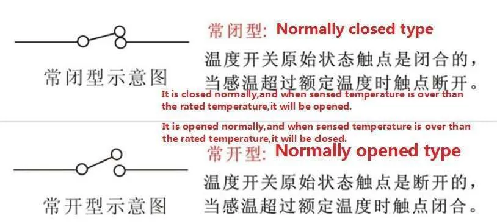
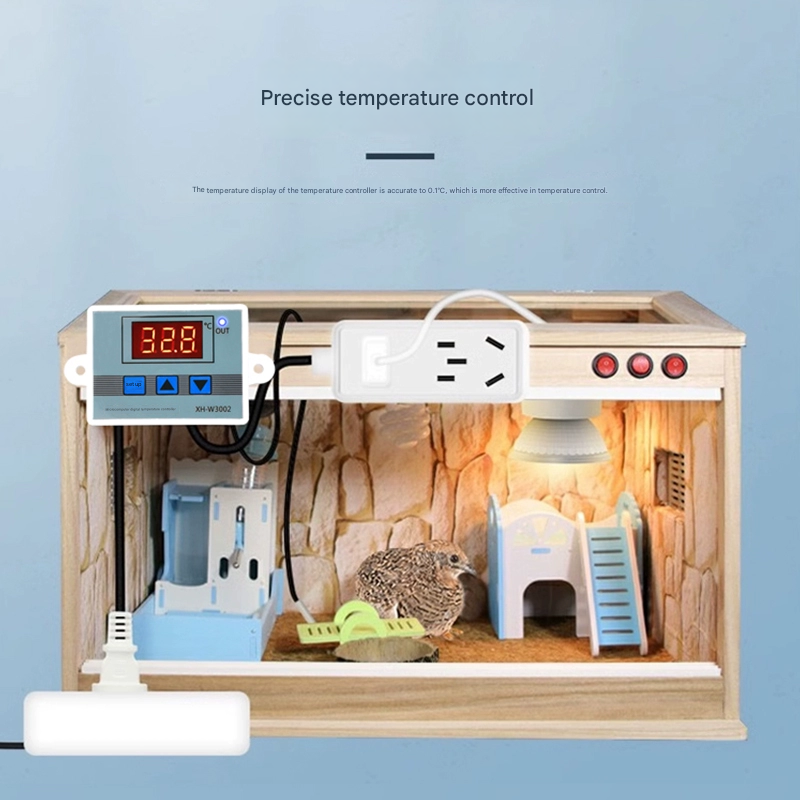
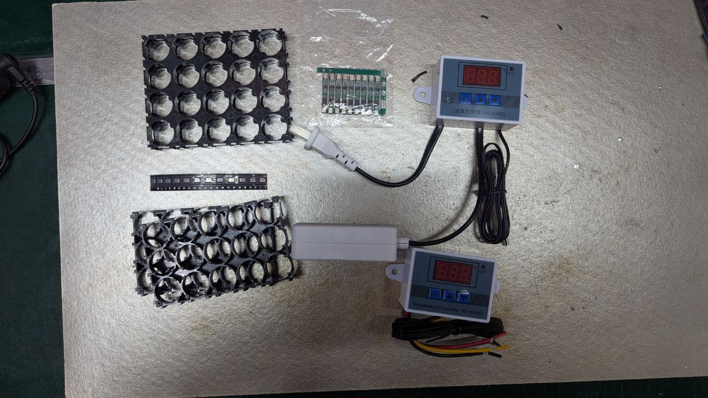

# thermostat

The KSD301 is a miniature, hermetically sealed bimetal thermostat. It has a single-pole single-throw structure and works under resistive load. The KSD301 has the following specifications: 

- Electrical rating: AC 125V max 15A; AC250V 5A 10A 15A max 16A
- Action temperature: 0~250 degree
- Recovery and action temperature difference: 10 to 25 degrees

https://en.wikipedia.org/wiki/Thermostat

# constant-temperature-dat

- temperature meansure and auto turn on the warming light 
- [[week-4-8-dat]]

These are two versions of the thermostat, both version have the temperature probe, and can connect acturator to cool or heat the box:
- 12V power supply + 12V power output 
- 220V power supply + 220V power output in the plug socket

## ref 

- [[app-dat]]

## ref 

- [[thermostat]]