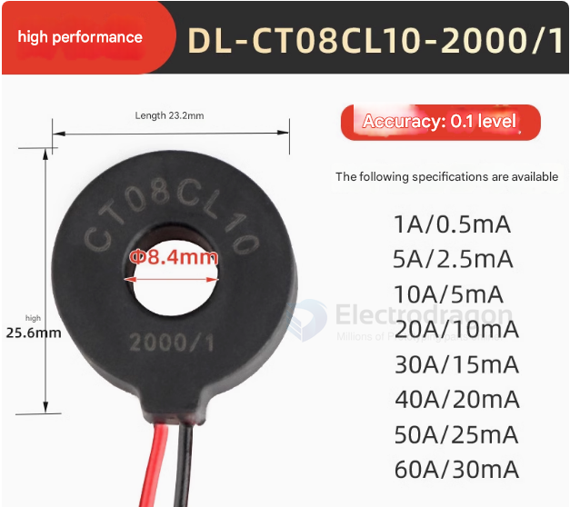

# current-transformer-dat

- [[current-sensor-dat]]

## PCB Mount 

- [[zeming-dat]]

## Open Split Core Current Transformer

- [[YHDC-dat]]

## Specifications 

"Miniature current transformer, small AC through-core type, class 0.1 precision, high-frequency transformer, lead type, 1000:1"

Here's a breakdown:

微型电流互感器: miniature current transformer

小型交流穿心式: small AC through-core type

0.1级精密: class 0.1 precision

高频互感器: high-frequency transformer

引线式: lead type (with wire leads)

1000:1: transformation ratio

## Other Form 

## ref 

- [[current-sensor]]