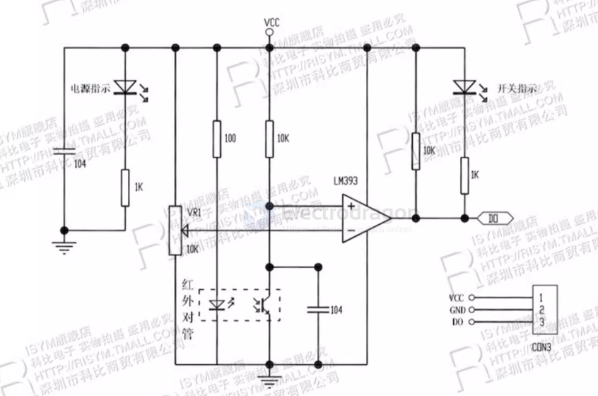

# sensor-IR-reflective-dat

- [[sensor-photoelectric-dat]]

## board 

- [[SMO1070-dat]] - [[SMO1003-dat]]

## working principles

该传感器模块对环境光线适应能力强，其具有一对红外线发射与接收管，发射管发射出一定频率的红外线，当检测方向遇到障碍物（反射面）时，红外线反射回来被接收管接收，经过比较器电路处理之后，绿色指示灯会亮起，同时信号输出接口输出数字信号（一个低电平信号），可通过电位器科比电子旋钮调节检测距离，有效距离范围2～30cm，工作电压为3.3V-5V。

该传感器的探测距离可以通过电位器调节、具有干扰小、便于装配使用方便等特点，可以广泛应用于机器人避障、避障小车、流水线计数及黑白线循迹等众多场合。

## Applications 

* Meter pulse data sampling
* Paper shredder machine detection
* Obstacle detection
* Black and white line detection

## IR TX RX pair module 

## ref 

- [[sensor-infrared-dat]]