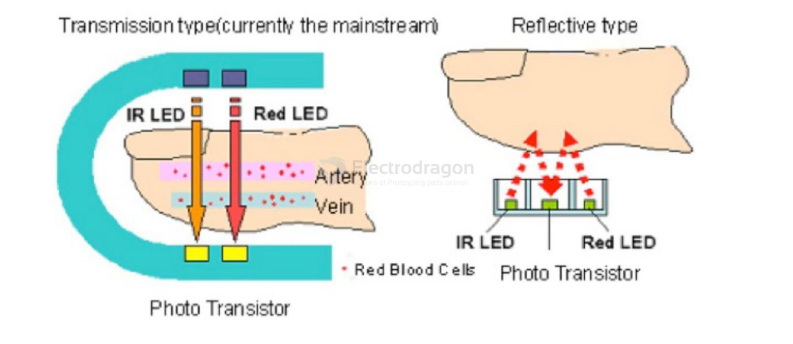

# pulse-rate-dat.md

## Principle Introduction:

How does the MAX30100 measure pulse rate? 

The device has two LEDs: 

one emits red light, and the other emits infrared light. 

Both red and infrared light are used to measure the oxygen level in the blood.

When the heart pumps blood, the amount of oxygenated blood increases due to the higher blood volume. As the heart relaxes, the volume of oxygenated blood decreases. The pulse rate is determined by knowing the time interval between the increase and decrease of oxygenated blood.

It turns out that oxygenated blood absorbs more infrared light and transmits more red light, while deoxygenated blood absorbs more red light and transmits more infrared light. This is the main operating principle of the MAX30100: it reads the absorption levels for both light sources and stores them in a buffer that can be read via I2C. However, it's not as simple as it sounds; significant data filtering and processing are involved.

