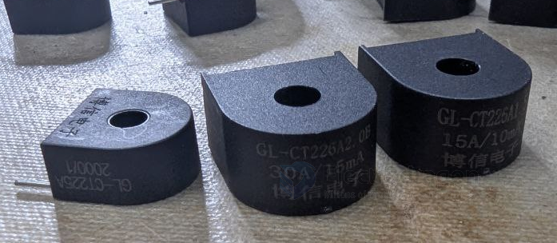
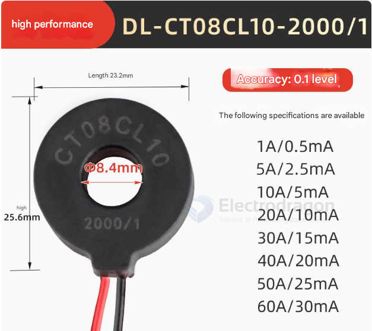

# current-transformer-dat

- [[current-sensor-dat]]

## tech 

- [[ZMCT103-dat]] == 1000:1 [[current-dat]] - [[current-transformer-dat]]
  
- [[ZMPT107-dat]] == 1000:1000 [[voltage-dat]] - [[ac-voltage-transformer-dat]] 

## boards 

- [[SVC1038-dat]] - [[SVC1042-dat]]

## PCB Mount 

- [[zeming-dat]] - [[EDCT-dat]]

- [[ZMCT103-dat]] == 1000:1 [[current-dat]] // - [[ZMPT107-dat]] == 1000:1000 [[voltage-dat]] || - [[current-transformer-dat]]

## Open Split Core Current Transformer

- [[YHDC-dat]]

## BX-CT Specifications

| left   | middle | right |
| ------ | ------ | ----- |
| 5A     | 15A    | 30A   |
| 2000:1 | 2000:1 | 1500: |

## DL-CT08CL10-2000/1 = Specifications 

"Miniature current transformer, small AC through-core type, class 0.1 precision, high-frequency transformer, lead type, 1000:1"

Here's a breakdown:

微型电流互感器: miniature current transformer

小型交流穿心式: small AC through-core type

0.1级精密: class 0.1 precision

高频互感器: high-frequency transformer

引线式: lead type (with wire leads)

1000:1: transformation ratio

## Other Form 

## ZHT103U 

ZHT103U series, current output type, with wire leads

**Specifications:**
- Accuracy class: 0.5
- Case material: Engineering plastic, flame retardant
- Dielectric strength: MQ / V/min
- Features: Fully potted, strong environmental resistance, high accuracy, good consistency, flexible installation, wide linear range
- Frequency range: KHz
- Input type: Single pass-through input, secondary wire output
- Insulation resistance: ≤35'32001000MQ / 500V/min
- Linear range: 0~10A
- Load resistance: 100Ω
- Operating temperature: -35℃~+75℃
- Output current (rated): 5mA
- Output type: Lead wire
- Rated input current: 5A
- Storage temperature: -40℃~+80℃
- Transformation ratio: 1000:1
- Typical applications: Power network meters, power transmitters, ammeters, measurement and control devices, etc.

## ref 

- [[current-sensor-dat]] 

- [[current-transformer]]

- [[AI]]