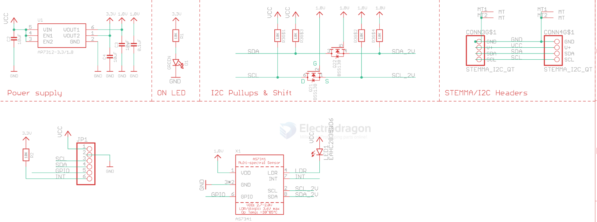

# light-sensor-dat

- legacy wiki page - https://w.electrodragon.com/w/Category:Light_Sensor

## UV light sensor 

- [[STH1024-dat]]

## light sensor 

- [[SMO1090-dat]] - [[SSL1034-dat]] - [[SSL1053-dat]]

## AS7341 

- datasheet == [[AS7341-DS000504.pdf]]

ams AS7341 – 11-Channel Spectral Color Sensor

AS7341 is an 11-channel multi-spectral sensor for color detection and spectral analysis applications. 

The spectral response is defined in the wavelengths from approximately 350nm to 1000nm. 

6 channels can be processed in parallel by independent ADCs while the other channels are accessible via a multiplexer. 

8 optical channels cover the visible spectrum, one channel can be used to measure near infra-red light and one channel is a photo diode without filter (“clear”). 

The device also integrates a dedicated channel to detect 50Hz or 60Hz ambient light flicker. 

The flicker detection engine can also buffer data for calculating other flicker frequencies externally. 

The NIR channel in combination with the other VIS channel may provide information of surrounding ambient light conditions (light source detection). 

The device can also be synchronized to external signals via pin GPIO.

## ref 

- [[sensor-dat]]

- [legacy wiki page ](https://w.electrodragon.com/w/Photosensitive_sensor)