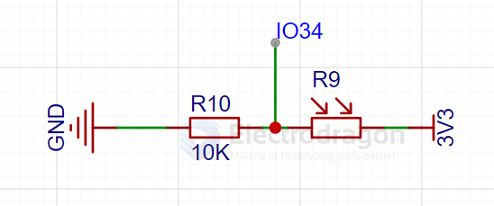

# light-sensor-dat

- legacy wiki page - https://w.electrodragon.com/w/Category:Light_Sensor

- [[ams-osram-dat]] - [[sensor-ambient-light-dat]]

- [[sensor-UV-light-dat]]

## light sensor 

- [[SMO1090-dat]] - [[SSL1034-dat]] - [[SSL1053-dat]]

- [[SSL1022-dat]]

## light density 

- OPT101

## SCH 

photocell - LDR - ESP32 

## ref 

- [[sensor-dat]]

- [legacy wiki page ](https://w.electrodragon.com/w/Photosensitive_sensor)