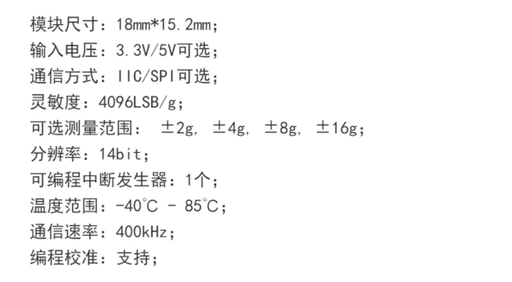

# 3-axis-Accelerometer-dat

- [[KX023-1025-dat]] - [[rohm-dat]]

- [[ADXL346-dat]] - [[ADXL345-dat]] - [[ADXL335-dat]]

- [[LIS3DSH-dat]] - [[LIS3DHTR-dat]] - [[LIS2DH12TR-dat]] - [[LSM6DS3TR-C-dat]]

3轴MEMS加速度计，超低功耗，±2g/±4g/±8g/±16g满量程，高速I2C/SPI数字输出，内置FIFO和高性能加速度传感器，LLGA 16 3x3x1.0封装

- [[MMA8452-dat]]

- [[MMA7361-dat]]

- [[TW-213-dat]]

- [[SC7A20H-dat]]

TW-213模块是一款用于测量3轴加速度的低功耗高精度传感器，具有低成本和高性能的特征，已被广泛应用于低功耗物联网产品以及智能手环等穿戴式电子设备上，具体可适用于计步、振动监测等应用场景。

## chips 

- SC7A20H

## boards 

- [[NBL1107-dat]]

## ref 

- [[sensor-dat]]