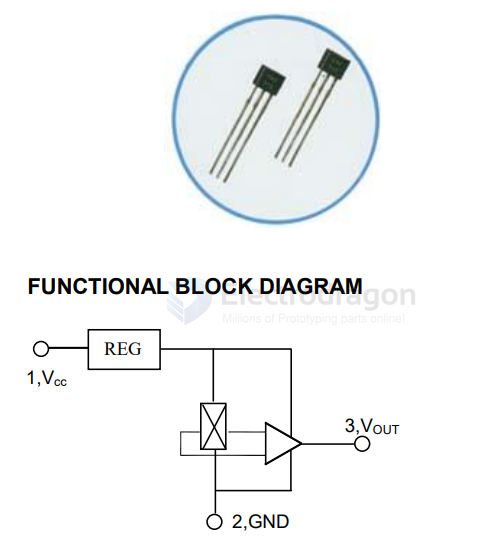

# sensor-hall-dat

- [[sensor-hall-swtich-dat]]

WCS2800 - Hall Effect Base Linear Current Sensor

## motor with hall sensor 

- [[motor-hall-dat]]

The AB phase encoder (left side of the diagram) outputs two pulse signals, A and B, which are orthogonal (90° out of phase), achieving a fourfold frequency harmonic. The speed measurement accuracy is four times that of a single-pulse encoder.

A single-pulse encoder (right side of the diagram) outputs only one pulse and has lower accuracy than the AB phase encoder. Therefore, for applications requiring high speed measurement accuracy, the AB phase encoder is recommended.

## 49E Linear Hall Effect Sensor

49E linear Hall-effect integrated circuit is based on Hall-Effect principle, which includes a voltage regulator, Hall-voltage generator, linear amplifier, and emitter-follower output stage. The output of the ICs changes linearly with the magnetic flux density that should be measured.

TYPICAL APPLICATION
-  Motion Detector
-  Gear Tooth Sensors
-  Proximity Detector
-  Speed Regulator for Sports Appliance
-  Current Detecting Senso

## more chips  

3144 - Surface mount 44E SOT23 Hall element A3144E sensor, unipolar HAL3144E switch type

CC6207ST SOT-23 Omnipolar Low-Power Hall Effect Switch Sensor

## ref 

- [[sensor-motion-dat]]