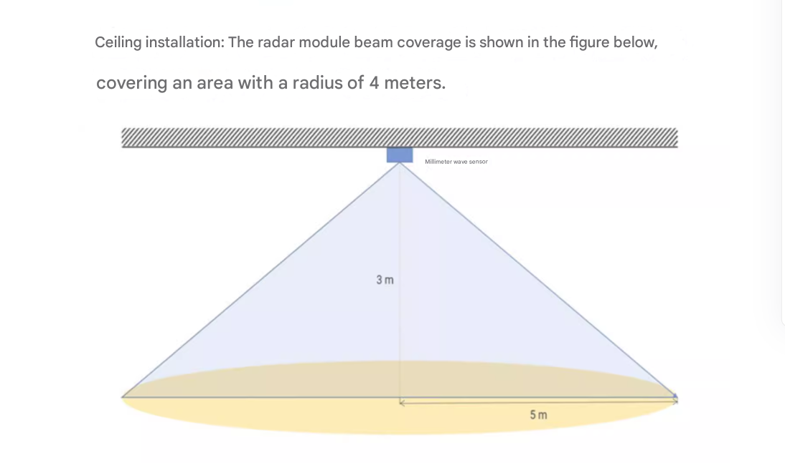
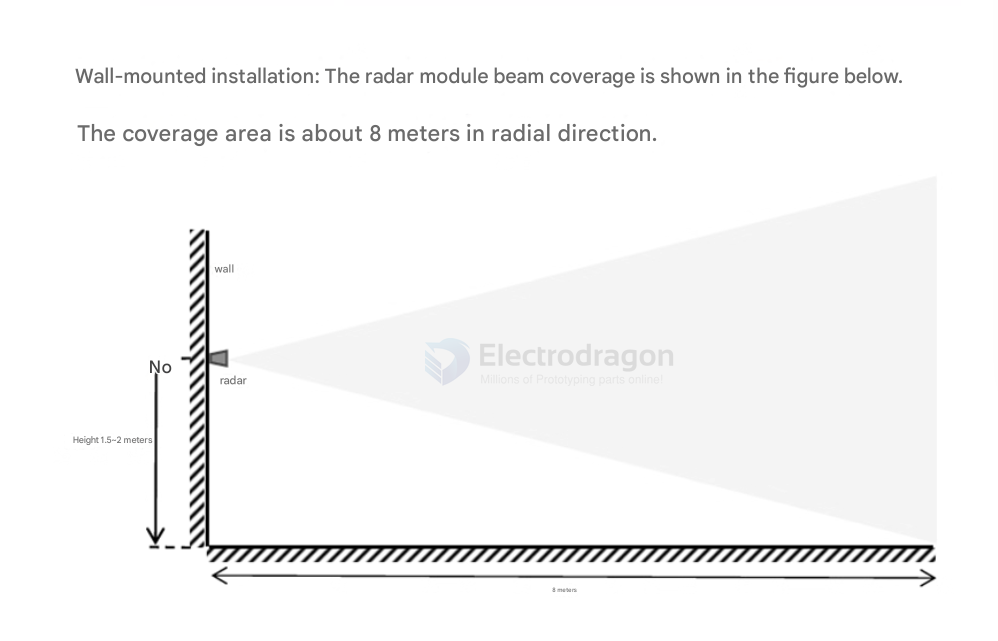

# radar-sensor-dat

- [[RCWL-sensor-dat]] - [[SMO1090-dat]]

**A radar sensor** uses radio waves to detect objects, measure their distance, speed, and direction. It works well in various weather and lighting conditions and is commonly used in automotive, industrial, and security applications.

**A lidar sensor** uses laser light to measure distances by emitting pulses and detecting their reflections. It creates high-resolution 3D maps of environments and is widely used in autonomous vehicles, robotics, and mapping. Lidar is more precise for shape and surface detection but can be affected by weather and lighting.

## radar sensor 

the coverage 

### Radar Note 

★如果雷达需要安装外壳，则外壳必须在24GHz频段具有良好的透波特性，且不能含有金属或对电磁波有屏蔽作用的材料：

### Radar Installation & Usage Notes

- If the radar needs to be installed in a housing, make sure the housing allows 24GHz signals to pass through easily. Do not use metal or materials that block electromagnetic waves.

- Install the radar in a suitable environment. Detection may be affected in these cases:
  - There are moving non-human objects in the sensing area (e.g., animals, moving curtains, large plants near air vents).
  - There are large, highly reflective surfaces facing the radar antenna (these can cause interference).
  - For wall-mounted installation, consider interference from air conditioners, fans, or other devices near the ceiling.

#### Installation Tips

- Point the radar antenna directly at the area to be detected, and keep the surroundings open and unobstructed.
- Make sure the sensor is mounted firmly and stably. Movement or shaking of the radar will affect detection.
- Avoid movement or vibration behind the radar. Radar waves can penetrate, so the antenna may detect motion behind it. Use a metal shield or backplate to block unwanted signals from the rear.
- If multiple 24GHz radars are used, do not point their beams directly at each other. Install them far apart to avoid interference.
- Power supply: Ripple should be minimal (no obvious peaks below 100kHz). This design is for reference only; users should consider ESD and lightning surge protection for electromagnetic compatibility.

### Radar Application 

This product is suitable for various AIoT scenarios, such as smart lighting control, advertising display activation, life safety protection, energy-saving for smart appliances, and security/intrusion detection.

## FMCW Radar 

millimeter wave radar == 毫米波雷达

### FMCW Radar Specifications

| Parameter             | Value                                             |
| --------------------- | ------------------------------------------------- |
| Frequency             | 24G–24.25GHz                                      |
| Sweep Bandwidth       | 250MHz (CE/FCC compliant)                         |
| Modulation            | FMCW                                              |
| Detection Angle       | ±60°                                              |
| Detection Distance    | Presence & micro-motion: 5m; Motion: 7m (typical) |
| Distance Resolution   | 0.15m (typical)                                   |
| Supply Voltage        | 3.3V (typical)                                    |
| Dimensions            | 20 × 20 mm                                        |
| Operating Temperature | -40°C ~ +85°C                                     |
| Data Format           | Serial ASCII output                               |
| Interface             | Default 2.54mm × 5Pin                             |

Here’s a comparison between RCWL and FMCW radar sensors:

RCWL (e.g., RCWL-0516) is a low-cost microwave motion sensor, typically using Doppler radar at 3.2GHz. It detects motion by measuring changes in reflected waves, but cannot measure distance or speed precisely. It’s mainly used for simple motion detection (e.g., lighting, alarms).

FMCW (Frequency Modulated Continuous Wave) millimeter wave radar (e.g., LD2402) operates at higher frequencies (24GHz). It emits a frequency-modulated signal and analyzes the frequency shift of the reflected wave to measure distance, speed, and even detect micro-movements. FMCW radars are more advanced, offering precise range and velocity detection, and are used in automotive, industrial, and security applications.

Summary:

RCWL: Simple, cheap, motion detection only, no distance/speed info.
FMCW: Advanced, precise, detects distance, speed, and micro-movements.

## ref 

- [[motion-sensor-dat]]