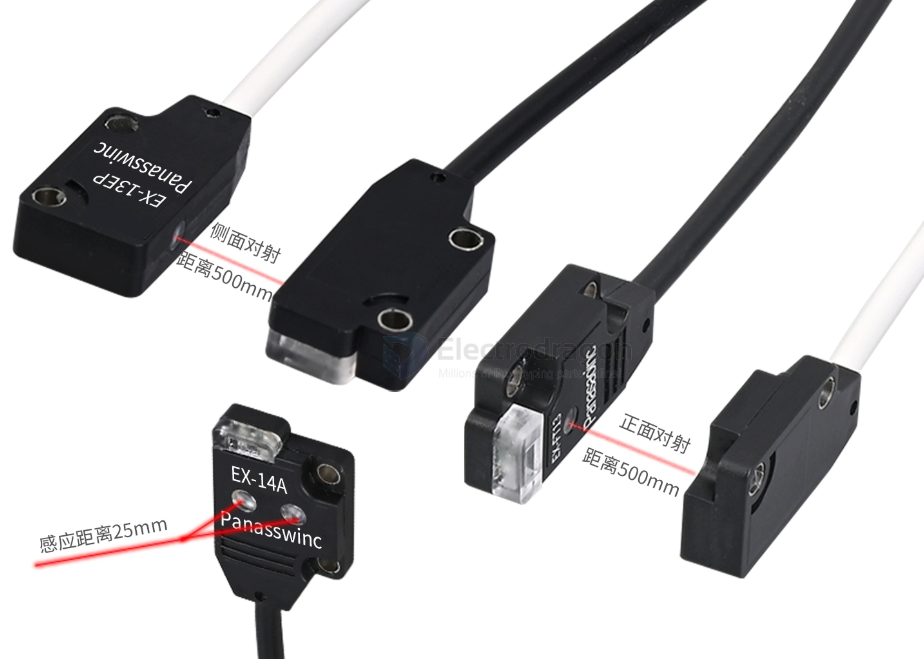
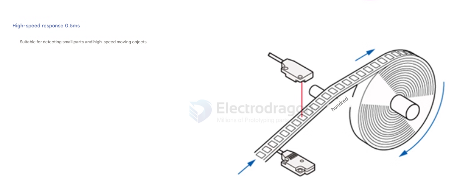
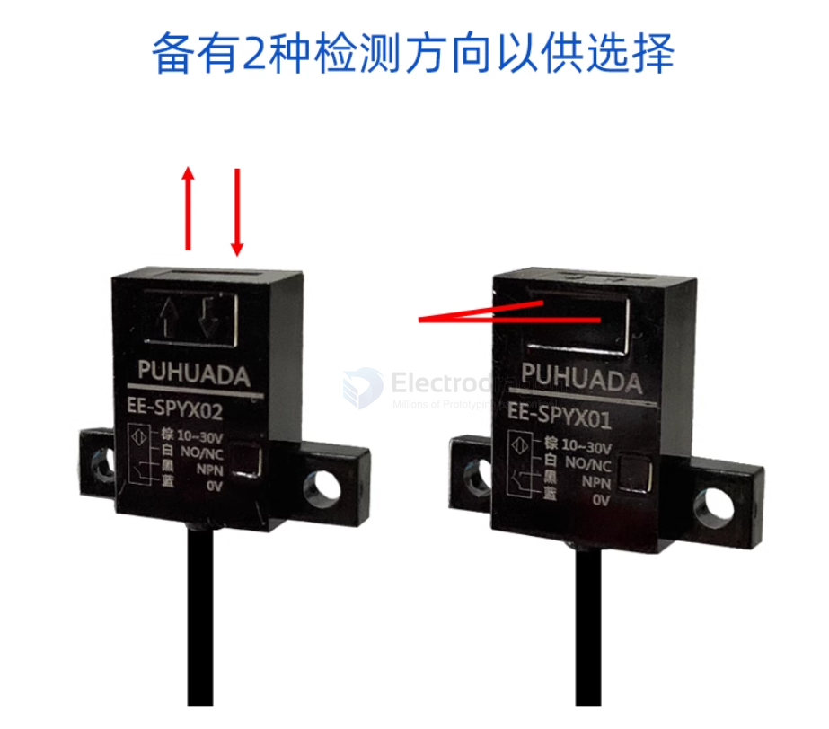
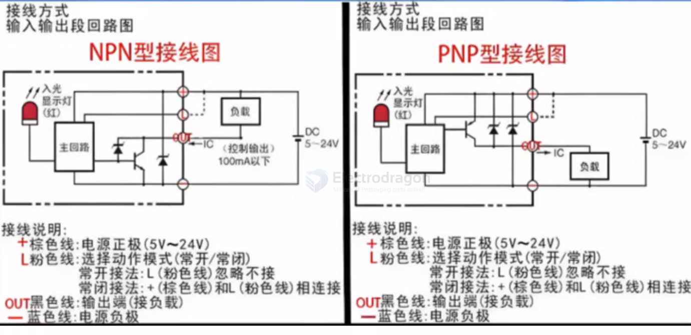
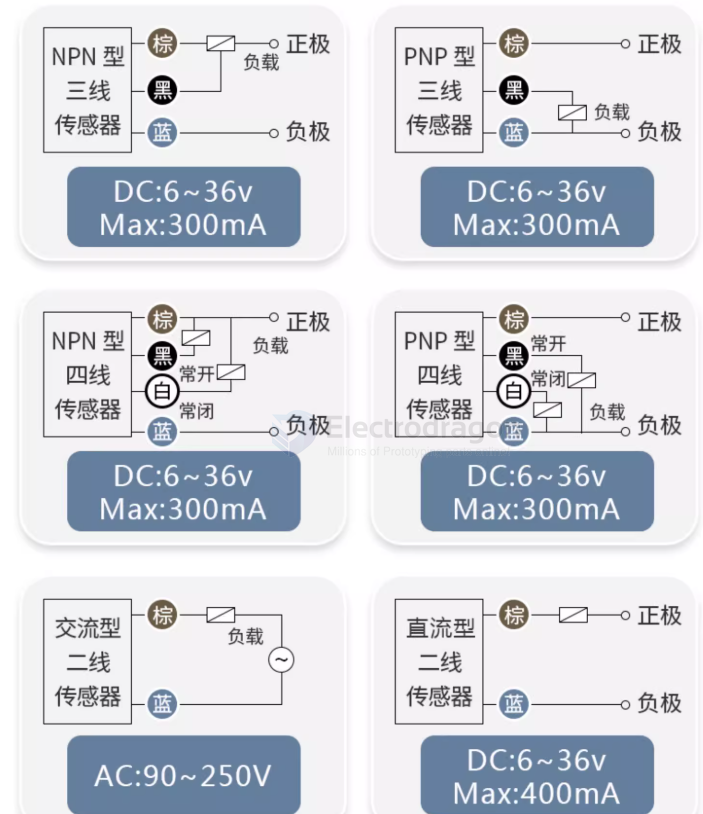
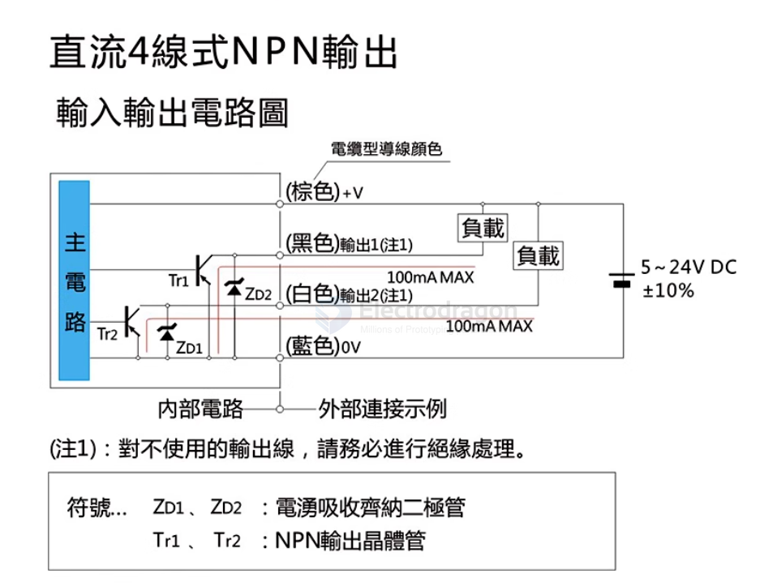
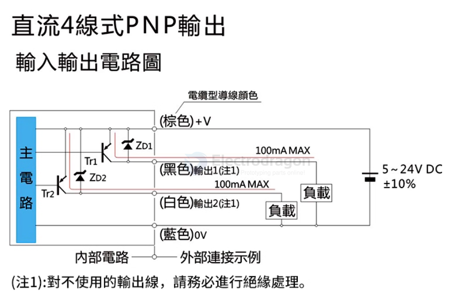

# sensor-photoelectric-dat

- [[sensor-IR-reflective-dat]] - [[sensor-infrared-dat]]

- [[sensor-reflective-dat]]

## board 

- [[SMO1070-dat]] - [[SMO1003-dat]] - [[SCU1020-dat]] - [[SIR1001-dat]]

## common types 

### Through-beam type（对射型）  

对射款 - 光电开关微型红光传感器

(pansonic shit-clone == Panasswinc)

#### Through-beam type（对射型）  APPs 

#### simple design of IR reflective 

- [[coilgun-dat]]

### Retro-reflective type（反射板型） 

### Diffuse reflective type（漫反射型）

## U-type Slot-type photoelectric sensor

- common slot dimension 5 mm 

## working principles 

- Infrared (IR) sensor — detects reflected IR light  
- Ultrasonic sensor — measures sound wave echoes  
- LIDAR sensor — uses laser light to detect distance  
- Radar sensor — uses radio waves  

### fiber optic photoelectric sensor == Diffuse reflective type

- [[fiber-optic-dat]]

## alternative names 

- Obstacle detection sensor  
- Obstacle avoidance sensor  
- Proximity sensor  
- Distance sensor  
- Object detection sensor  
- Range sensor

## common drive methods 

NPN与PNP概念解读

NPN:表示共正电压，输出负电压；
PNP:表示共负电压，输出正电压；
NPN NO:表示常态下是常开的，检测到物体时黑色线输出一个负电压信号
NPN NC:表示常态下黑色线是输出负电压信号，检测到物体时，断开输出信号
PNP NO:表示常态下时常开的，检测到物体时黑色线输出一个正电压信号
PNP NC:表示常态下黑色线是输出正电压信号，检测到物体时，断开输出信号

## DC NPN drive 

## DC ~24V PNP drive

## ref 

- [[sensor-dat]]