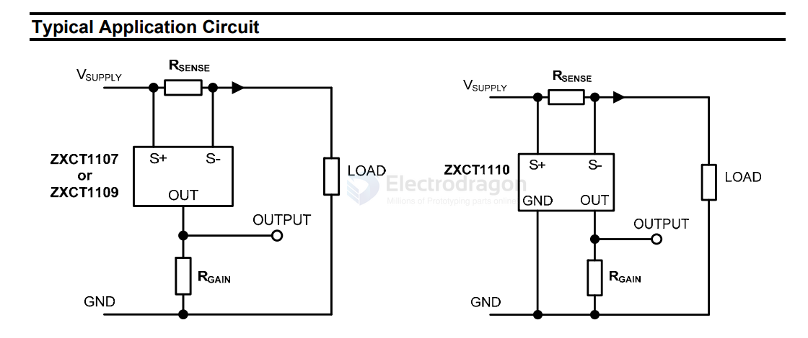

# dc-current-sensor-dat

## TI 

- [[TI-sensor-dat]] - [[Allegro-DAT]]

- [[MAX471-dat]] == Precision, High-Side, Current-Sense Amplifiers

- [[INA169-dat]]

- [[INA226-dat]]

- [[INA219-dat]] 

Genuine INA199B1DCKR SC-70-6 Bidirectional Current Sensing Amplifier Chip

- INA181 

- [[INA128-dat]] - [[INA129-dat]]

## diodes 

- [[diodes-dat]] 

ZXCT1110W5 - ZXCT1107/1109/1110 - LOW POWER HIGH-SIDE CURRENT MONITORS 

SOT23 packages
- 3-pin ZXCT1107/09
- 5-pin ZXCT1110

- [[LM358-dat]]

## ref 

- [[sensor-current-dat]]