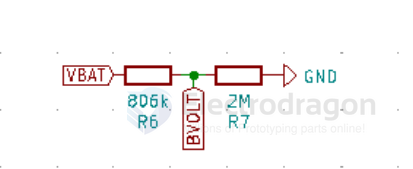
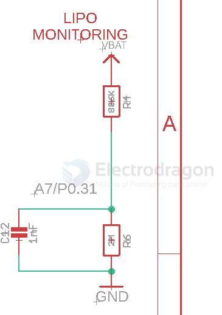

# sensor-dc-voltage-dat

- [[voltage-divider-dat]]

- [[INA219-dat]] - [[sensor-dc-voltage-dat]] - [[INA226-dat]] - [[power-sensor-dat]]

- [[sensot-dat]]

## battery read 

- 2M / 806K 1% 

## ref 

- [[sensor-voltage-dat]]

