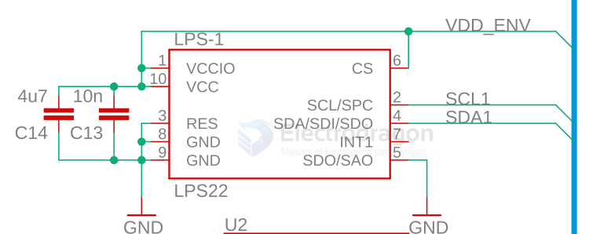
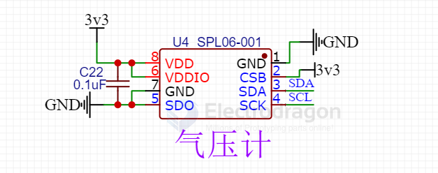

# sensor-pressure-dat.md

[legacy wiki page](https://w.electrodragon.com/w/Category:Pressure_Sensor)

- [[BME280-dat]] - [[bosch-dat]] - [[BMP280-dat]] - [[STH1060-dat]]

- [[LPS22HB-dat]] - [[st-sensor-dat]] - [[sensor-pressure-dat]] == MEMS nano pressure sensor: 260-1260 hPa absolute digital output barometer

https://www.st.com/en/mems-and-sensors/lps22hb.html

- [[goermicro-dat]]

SSCDRRN160MDAA5 - [[honeywell-dat]]

## SPL06-001 

## unsort 

- [[NXP-dat]]

## ref 

- [[sensor-dat]]