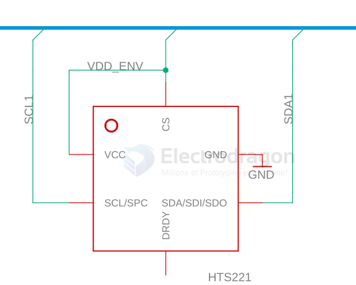

# sensor-temp-hum-dat

## solutions list 

- [[BME280-dat]] - [[bosch-dat]] 

- HDC1080 

- HTU21D
- HTU31D

- [[STH1033-dat]]

- [[sensor-temp-hum-dat]] - [[aosong-dat]] 

- [[AHT20-dat]] - [[NBL1107-dat]] - [[aosong-dat]] - [[AM2322-dat]] - [[AM1011-dat]]

- [[SHT30-dat]] - [[SHT4x-dat]] - [[sensor-temp-hum-dat]] - [[SHT40-dat]] - [[Sensirion-dat]]

HTS221 

Capacitive digital sensor for relative humidity and temperature

HTS221 is in the process of being terminated and is not recommended for new design. The candidate replacement is SHT40-AD1B from Sensirion. 

A deep-dive transition guide, technical note TN1426, is available on www.st.com, providing a high-level reference to guide the user in replacing STMicroelectronics HTS221 sensor with the SHT4x sensor family from Sensirion as a high-quality alternative. 

- [[SHT40-dat]] - [[Sensirion-dat]]

## Application:

HVAC, humidifier, dehumidifier, communication, atmospheric environmental monitoring, industrial process control, agriculture, measuring instruments and other applications.

## ref 

- [[sensor-dat]]