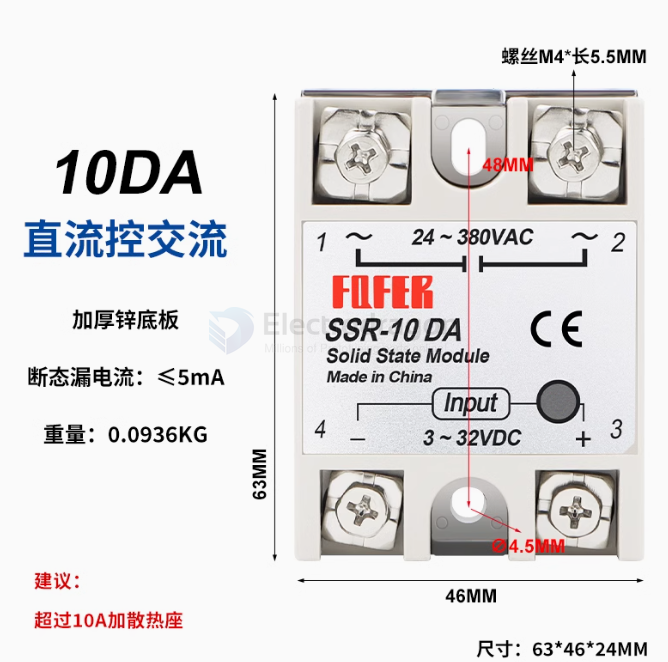
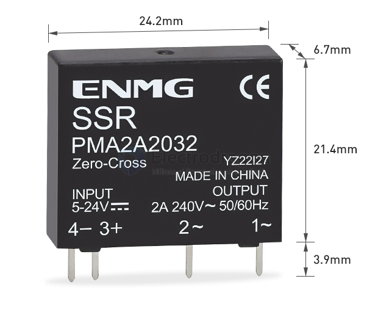
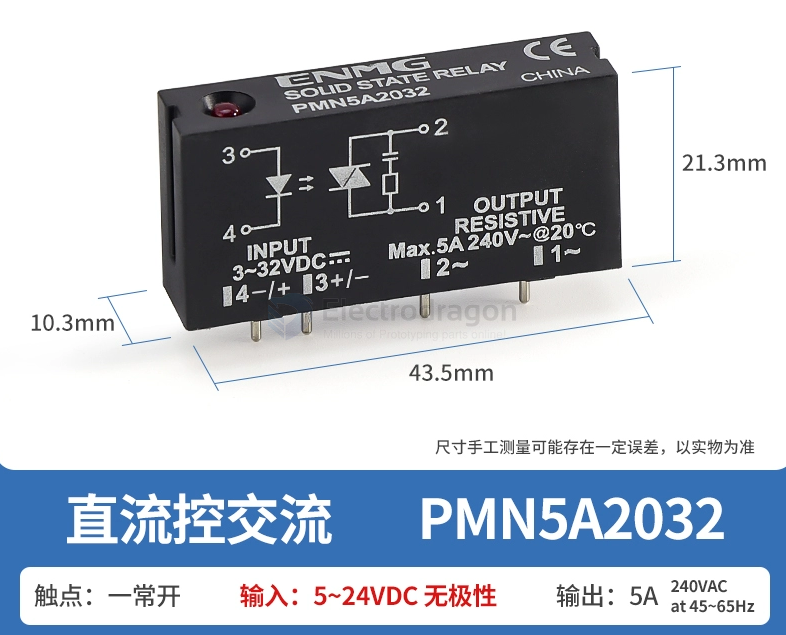

# SSR-relay-dat

## drawbacks of the SSR relay 

While SSRs offer numerous advantages over mechanical relays, they also have some drawbacks:

- Temperature Sensitivity: SSRs can be sensitive to high temperatures, which can affect their performance and lifespan. Operating them within their specified temperature range is crucial.
- Turn-on Surge Current: SSRs can draw a large surge current during turn-on, which can cause voltage drops in the power supply or damage sensitive loads. This can be mitigated by using surge suppressors or soft-start circuits.
- Higher Cost: SSRs are generally more expensive than mechanical relays, especially for high-current applications.
- Limited Current and Voltage Ratings: SSRs have limitations on the maximum current and voltage they can handle. Exceeding these limits can lead to damage or failure.
- Susceptibility to Transient Voltages: SSRs can be sensitive to transient voltages, which can cause premature failure. Proper shielding and grounding can help protect them from these transients.
- Potential for Latching: In some cases, SSRs can latch on or off, making it difficult to control their state. This can be prevented by using appropriate drive circuits and control methods.

## standalone type SSR relay 

## PCB Type of SSR relay 

output - 2A/240V

output - 5V/240V

## SSR VS TRIAC 

| Feature         | TRIAC                                      | Solid State Relay (SSR)                       |
| --------------- | ------------------------------------------ | --------------------------------------------- |
| Basic Function  | AC power control through triggering        | Switching AC or DC loads with isolation       |
| Structure       | Single semiconductor device                | Complete isolated switching unit              |
| Triggering      | Directly through gate terminal             | Low-voltage control signal (AC or DC)         |
| Isolation       | No inherent isolation                      | Opto-isolation between control and load sides |
| Switching Speed | Fast but can be noisy with inductive loads | Fast, smooth, and silent switching            |
| Durability      | Moderate (affected by wear and tear)       | High (no mechanical parts)                    |
| Applications    | Light dimming, motor control, heaters      | Industrial automation, temperature control    |
| Cost            | Lower                                      | Higher, but with added features               |

### Choosing Guide:

- If **safety** and **isolation** are critical (e.g., in industrial environments or sensitive electronics), an SSR is usually the better choice.
- For **simple AC power control** and **cost-sensitive applications**, especially where isolation isn't a concern, a TRIAC will suffice.
- If you’re dealing with **high-frequency switching, inductive loads**, or need reliable performance in harsh environments, an SSR would be preferable.
- For **microcontroller-based projects** that require easy, safe switching, go with an SSR due to its ease of interfacing and built-in isolation.

In summary:

- **Choose TRIAC** if you need basic AC control, minimal cost, and don't require isolation.
- **Choose SSR** if you need isolation, durability, fast switching, or you’re controlling sensitive systems or loads frequently.

## datasheet 

- [[omron-dat]]

## ref 

- [[relay]] - [[relay-dat]]
