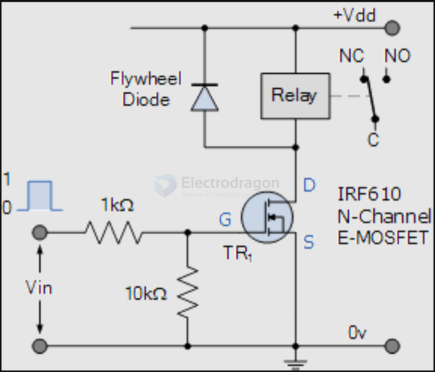

# relay dat 

- legacy wiki page - https://w.electrodragon.com/w/Category:Relay

### SPST relay 

HF32F-G-5-HS
- Common - open,
- 10A
- 250VAC or 30VDC

### SPDT Relay 

- [[songle-dat]] - [[hongfa-dat]] - [[omron-dat]]

- [[SSR-relay-dat]]

## relay control schematic 

using N-mos mosfet control 

## ref 

- [[relay]]