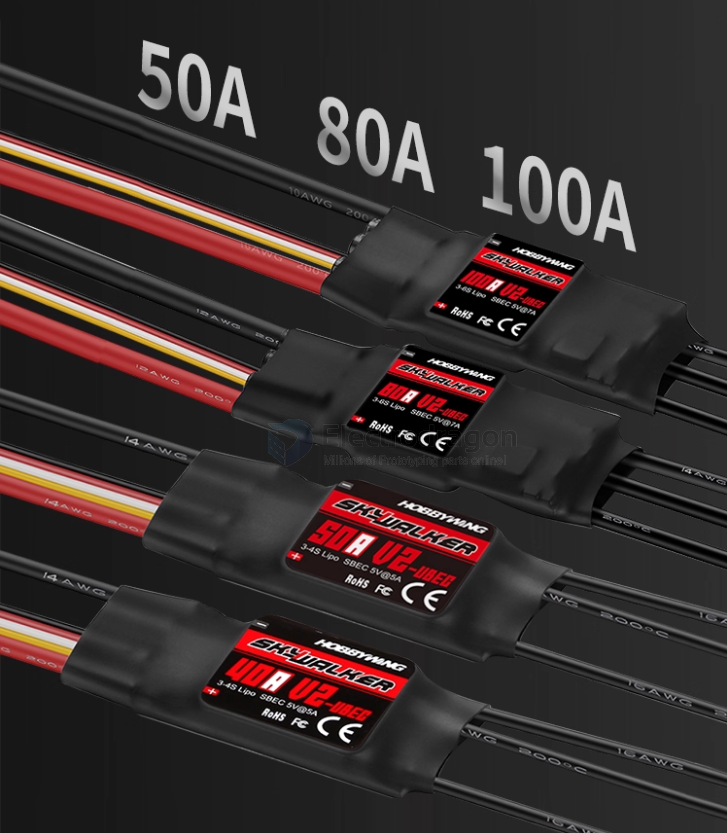

# ESC-dat

- **Electronic Speed Controller (ESC)**: Controls the speed of the motors by adjusting the power supplied to them. ESCs are essential for smooth and responsive flight.

## ref 

- [[acturator-dat]]