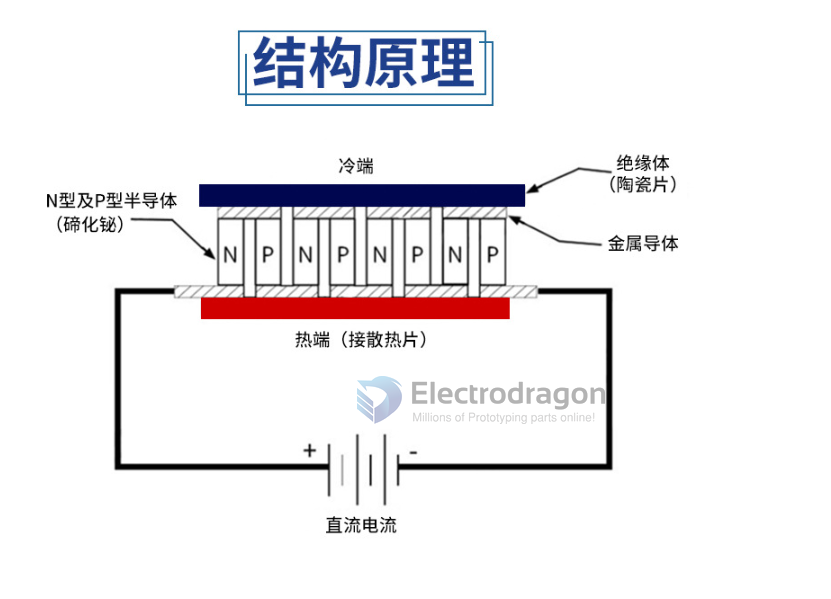
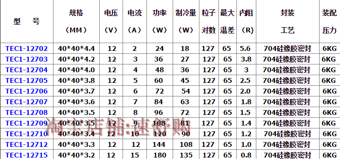
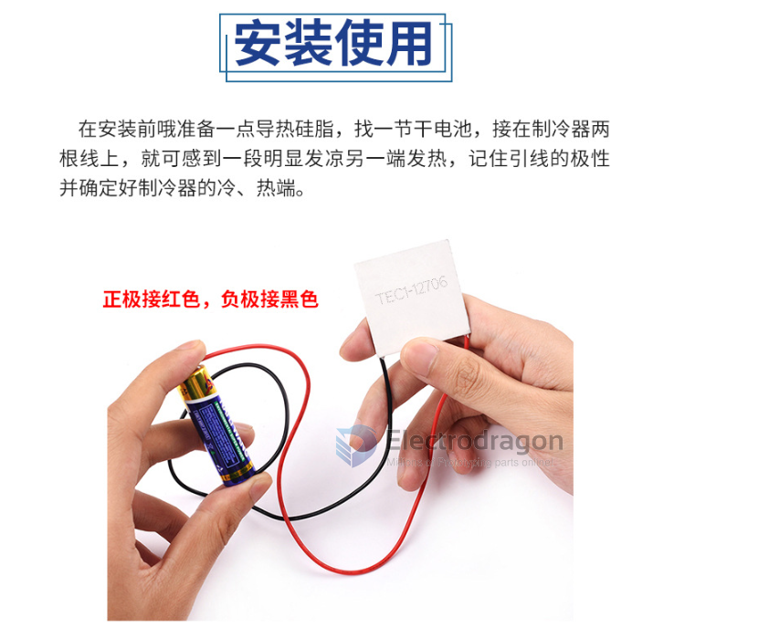
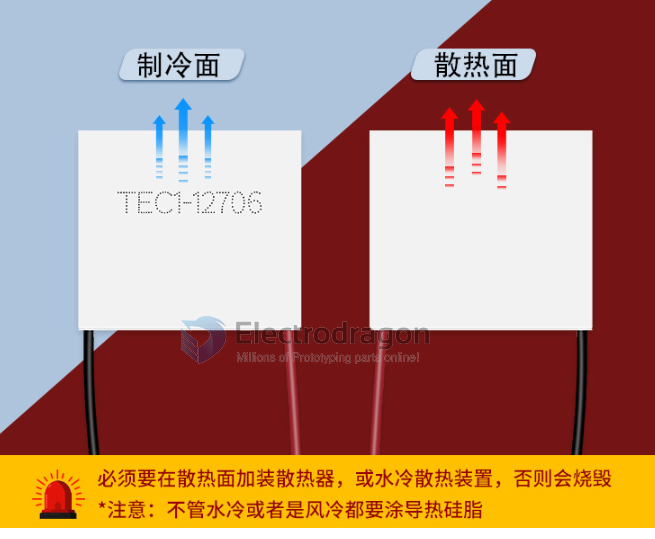

# Peltier

## working principle 

## product 

- [[TEC-12706-DAT]] - [[TEC-12712-DAT]]

- 12706 [[SCU1033-DAT]] - 12712 [[SCU1035-DAT]]

- cooling kit [[SCU1038-DAT]]
  

## specs 

dimension / voltage / current / watt / cooling watt / particle pairs / max. temp / internal resistance / sealing tech / assembly pressure 

## note 

The side with words are the cooling side, and other side is the warm side.

## Demos 

- demo video of the cooling kit 
- https://www.youtube.com/watch?v=N4TXLpb_8mY

## legacy information
- https://w.electrodragon.com/w/Thermoelectric_Cooler
- https://w.electrodragon.com/w/Peltier

## Tesing 

- testing with AA battery 

- code side normally on works side
- Heat dissipation should always be implemented when using with large current flow
  

## Ref 

- [Product link](https://www.electrodragon.com/product/tec1-12706-thermoelectric-peltier-cooler-12v-60w/)