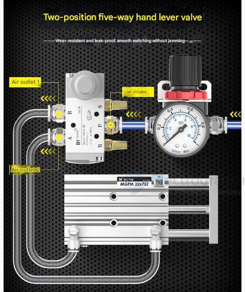

# actuator 

- [[piezo-dat]]

- [[relay-dat]] - [[SSR-relay-dat]]

- [[servo-dat]] - [[stepper-dat]]

- [[motor-dat]] - [[vibrator-dat]] - [[motor-brushed-dat]] - [[Motor-reduction-Gear-dat]]

- [[motor-driver-dat]] - [[mosfet-dat]] - [[switching-dat]] 

- [[TRIAC-dat]] 

- [[Linear-Rail-dat]] - [[solenoid-valve-dat]]

- [[solenoid-dat]]

- [[laser-module-dat]]

- [[buzzer-dat]] - [[speaker-dat]] - [[SSL1019-dat]]

- [[belt-dat]] - [[belt-sys-dat]] - [[pulley-dat]] - [[mechanics-dat]]

- [[pump-dat]]

- [[thermal-printer-dat]]

## Boards 

- [[SCU1080-dat]] - [[SCU1030-dat]]

- [[SCU1050-dat]]

## other 

- level-valve 

## ref 

- [[sensor-dat]]

- [[tech-dat]]