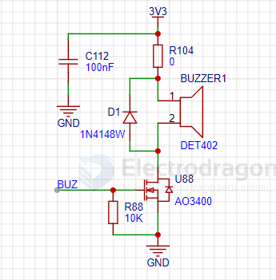
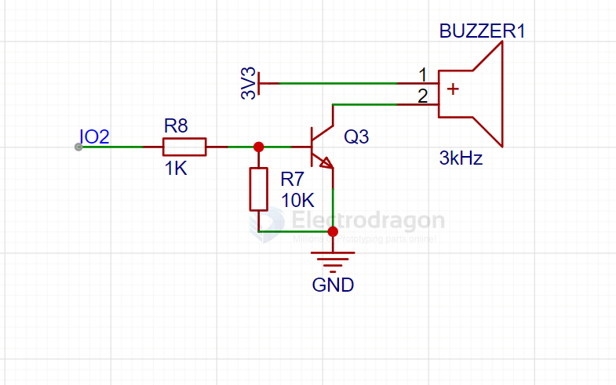

# buzzer-dat

- [[wave-dat]]

active buzzer - [[SSL1019-dat]]

passive buzzer 
- [[SSL1011-dat]] - [[SSL1012-dat]]

[[piezo-dat]] buzzer 
- [[SCU1080-dat]]

## Types of Buzzers

### Active Buzzer
An active buzzer has a built-in oscillator, allowing it to produce sound when powered with a DC voltage. It is simple to use and does not require an external signal.

- **Features**:
  - Built-in oscillator
  - Produces a fixed tone
  - Easy to use (plug-and-play)
  - Requires only DC voltage to operate

- **Applications**:
  - Alarms
  - Timers
  - Simple sound notifications

### Passive Buzzer
A passive buzzer requires an external oscillating signal to produce sound. It offers more flexibility, allowing you to control the tone and frequency.

- **Features**:
  - Requires an external signal (e.g., square wave)
  - Fully customizable sound (tone, frequency, duration)
  - Controlled via microcontrollers or signal generators

- **Applications**:
  - Musical projects
  - Custom sound patterns
  - Advanced sound notifications

## Comparison Table

| Feature            | Active Buzzer                  | Passive Buzzer                 |
|---------------------|--------------------------------|---------------------------------|
| Oscillator          | Built-in                      | External (requires signal)     |
| Ease of Use         | Plug-and-play                 | Requires programming/control   |
| Sound Control       | Limited (fixed tone)          | Fully customizable             |
| Power Requirement   | DC voltage                    | Oscillating signal             |

## SCH 

simple drive 

## Related Links
- [[SSL1019-dat]]
