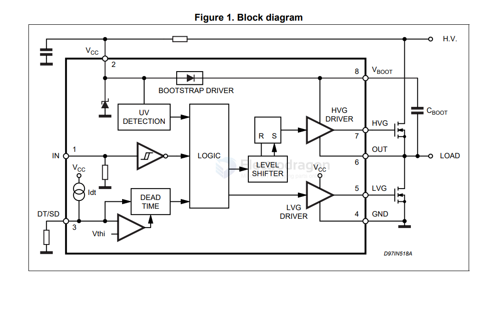

# driver-half-bridge-dat

- [[driver-half-bridge-dat]] - [[control-dat]] - [[motor-driver-dat]]

## High voltage half-bridge driver

L6384E

High voltage rail up to 600 V

### Applications

- Home appliances
- Induction heating
- HVAC
- Industrial applications and drives
- Motor drivers – DC, AC, PMDC and PMAC motors
- Lighting applications
- Factory automation
- Power supply systems

## ref

