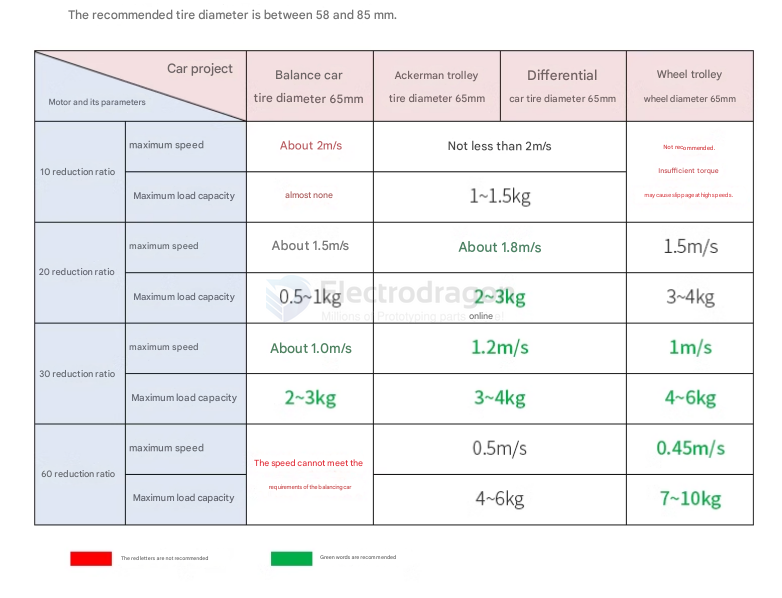
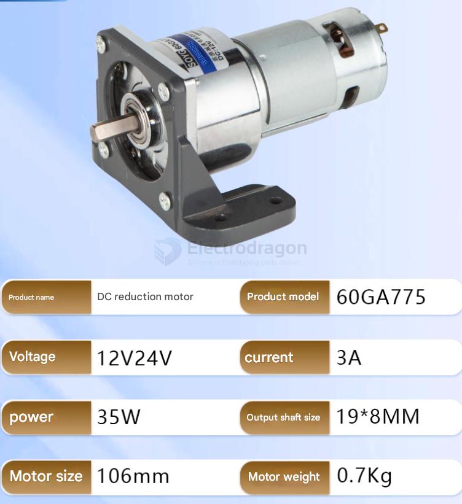

# DC-Gear-Motor-dat

## driver 

- [[TB6612-dat]] - [[L298-dat]]

# reduction-gear-motor-dat

- [[N20-motor-dat]] - [[MG513-dat]]

- [[torque-dat]]

- [[encoder-dat]]

- [[TT-motor-dat]]

## Apps and Specs Selection 

## Definitions 

⚙️ A DC motor that has a gearbox (gear reduction unit) attached to it — usually on the output shaft.

### 🔧 Why Use a Gear Motor?

| Feature                | Effect                                               |
|------------------------|------------------------------------------------------|
| **Lower speed (RPM)**  | The gearbox reduces the motor’s high speed          |
| **Higher torque**      | Gear reduction increases torque at the output shaft |
| **Better control**     | Easier to manage at low speeds (no stalling)        |
| **Compact design**     | All-in-one motor + gearbox in one body              |

---

### 🔁 Example:

- A regular DC motor might spin at **6000 RPM**
- With a **50:1 gear ratio**, the output becomes **~120 RPM**, but with ~50× more torque (minus losses)

If your 895 motor lacks torque even with a gearbox, consider:

- High-torque 24V–36V gear motors, 300W–1000W
- Brands: **Zhenlong**, **MY1016**, **E-Tek**

**Use**: Robotics, automation, e-mobility, conveyor systems

## ref 

- [[motor-dat]]

- [[DC-Gear-Motor]] - [[motor]]