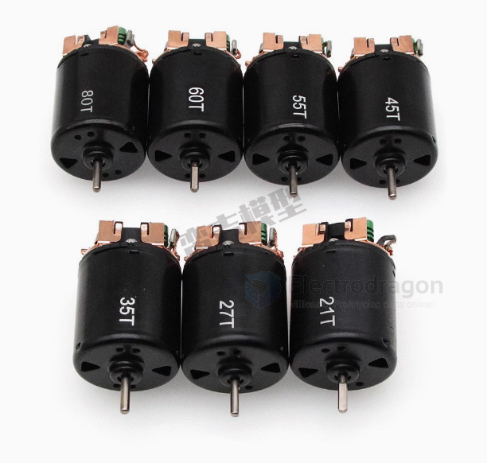
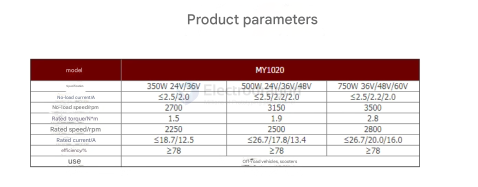
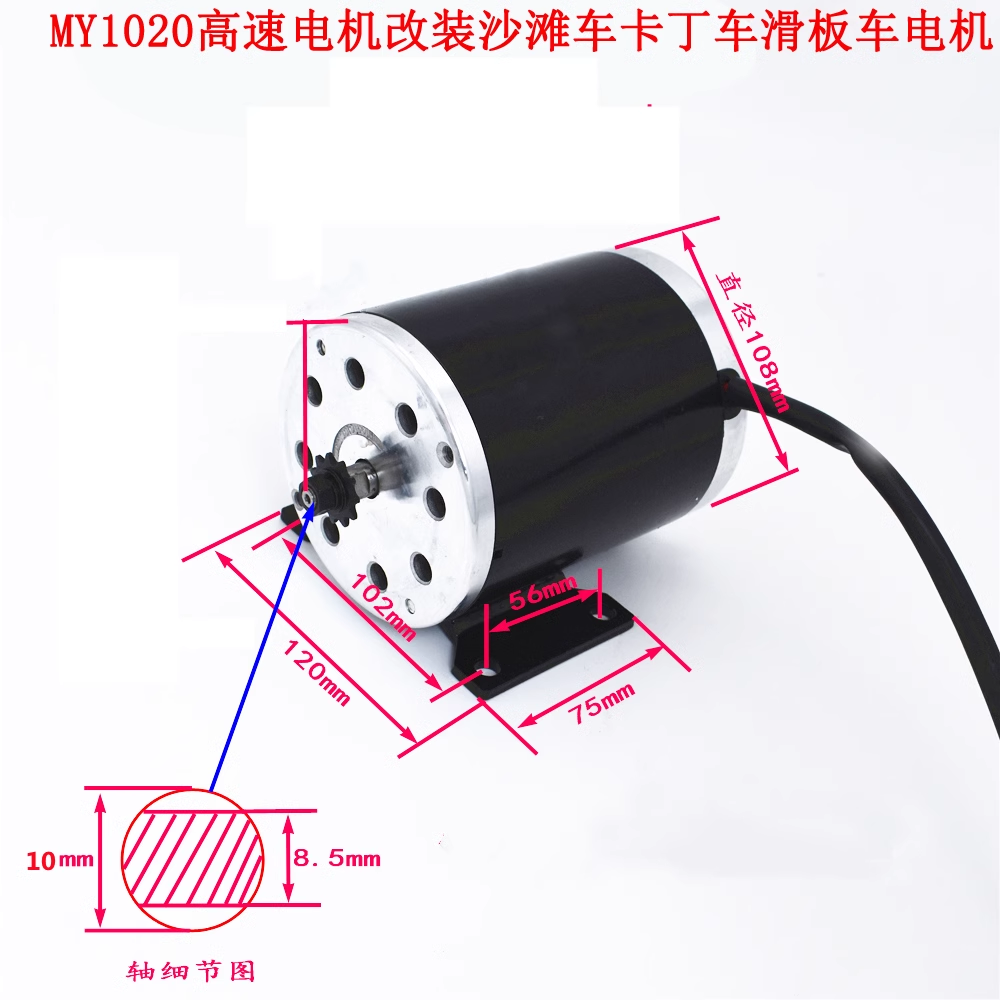

# DC-motor-DAT

## Small Brushed DC Motor Series

| Motor Series | Size (approx.)  | Voltage Range | Typical Power | Common Use                                |
| ------------ | --------------- | ------------- | ------------- | ----------------------------------------- |
| **N20**      | 10 × 12 × 15 mm | 3V – 12V      | <1 W          | Micro robots, locks, cameras              |
| **030**      | ~15 mm length   | 1.5V – 3V     | <0.5 W        | Tiny toys, fans                           |
| **130**      | ~20 mm length   | 1.5V – 6V     | ~1–3 W        | Toys, vibrators, mini fans                |
| **180**      | ~25 mm length   | 1.5V – 6V     | ~2–4 W        | Small models, RC cars                     |
| **230**      | ~30 mm length   | 6V – 12V      | ~5–20 W       | Toys, small tools, RC models              |
| **260**      | ~32 mm length   | 6V – 12V      | ~10–25 W      | Slot cars, drills, small pumps            |
| **280**      | ~35 mm length   | 6V – 18V      | ~15–30 W      | Toys, CD drives, robotics                 |
| **360/365**  | ~40 mm length   | 6V – 18V      | ~20–50 W      | Hobby tools, gearboxes                    |
| **380**      | ~45 mm length   | 6V – 18V      | ~20–60 W      | RC cars, fans                             |
| **390**      | ~48 mm length   | 6V – 24V      | ~30–70 W      | Motors with higher torque                 |
| **540**      | ~55 mm length   | 6V – 24V      | ~50–150 W     | RC cars, robots, small drills             |
| **550**      | ~60 mm length   | 6V – 24V      | ~75–200 W     | Power tools, gearboxes                    |
| **775**      | ~70 mm length   | 12V – 24V     | ~150–350 W    | High-power drills, CNC, mobility projects |
| **895**      | ~80 mm length   | 12V – 36V     | ~200–500 W    | High torque, heavy loads                  |

- more powerful motors - [[BLDC-motor-dat]] - [[DC-Gear-Motor-dat]]

## 1. 45T / 55T Motors

- **"T" = Turns** of wire on the motor armature.
- **Higher T (e.g., 55T)** = **More torque, lower speed**.
- **Lower T (e.g., 12T)** = **Higher speed, lower torque**.
- Typically **540-size** brushed motors.
- Commonly used in **RC crawling/trailing** for torque and control.
- A **45T motor** has **45 wraps (turns)** of copper wire around each pole of the armature.
- The number of turns affects the **motor's speed and torque**.

Series = 19T / 21T / 27T / 35T / 45T / 55T / 60T / 80T

### Summary Table

| Spec   | 45T / 55T Motor       | 130 / 230 Motor           |
| ------ | --------------------- | ------------------------- |
| Type   | Brushed RC Motor      | Toy motor                 |
| Size   | 540-class             | Small can-type            |
| Torque | High (esp. 55T)       | Low                       |
| Speed  | Low (esp. 55T)        | Moderate                  |
| Usage  | RC crawling, trailing | Toys, fans, small gadgets |

### 🔧 Approximate Torque Value
- **Torque (stall):** ~300 to 400 g·cm (gram-centimeter)
- **At 7.2V to 7.4V (common RC voltage)**

> ⚠️ Note: This is an estimate. Some high-end 45T motors may produce more torque.

### 📊 Comparison Table (Typical RC Motors at 7.2V)

| Motor Type | Turns | Torque (g·cm) | Speed (RPM)    |
| ---------- | ----- | ------------- | -------------- |
| Racing     | 12T   | ~100–150      | ~30,000–35,000 |
| Balanced   | 27T   | ~200–250      | ~15,000–20,000 |
| Torque     | 45T   | ~300–400      | ~9,000–11,000  |
| Crawler    | 55T   | ~400–500      | ~7,000–9,000   |

- [[torque-dat]]

## 📊 Size Comparison Table

| Motor Name | Diameter (mm) | Length (mm) | Power Level        | Common Use                         |
| ---------- | ------------- | ----------- | ------------------ | ---------------------------------- |
| 130        | ~15.5         | ~20         | Small / Light-duty | Toys, small fans                   |
| 230        | ~24           | ~30         | Medium             | DIY cars, small robots             |
| 260        | ~24           | ~36         | Medium-High        | Hobby motors, gear motors          |
| 280        | ~24           | ~45         | High               | RC cars, small drills              |
| 380        | ~28           | ~50–60      | Very High          | Power tools, electric screwdrivers |
| 540        | ~36           | ~50         | Ultra High         | RC racing cars, e-bikes            |

## 130 Motor Overview

The **130 motor** is a type of **DC motor** commonly used in toys, small appliances, and DIY electronics projects.

### 🔧 Type

- **Type:** Permanent Magnet Brushed DC Motor
- **Category:** Small-size DC Motor

### ⚙️ Specifications (Typical)

- **Voltage Range:** 1.5V – 6V (Commonly 3V or 5V) ??? try up to 7V 
- **High RPM:** Often from a few thousand to over 10,000 RPM
- **Low Torque:** Suitable for light-load applications
- **Brush Type:** Brushed (uses carbon brushes and a commutator)

## 230 Motor Overview

The **230 motor** is a small **DC motor**, similar in design to the 130 motor but typically **larger in size and power**.

### 🔧 Type

- **Type:** Permanent Magnet Brushed DC Motor
- **Category:** Medium-size DC Motor

### ⚙️ Specifications (Typical)

- **Voltage Range:** Often 3V – 12V
- **Higher Torque and Power** than 130 motor
- **Medium RPM** (usually lower than 130 motor, but stronger)
- **Brush Type:** Brushed (uses carbon brushes)

## Why Is It Called a "230 Motor"?

The name **"230 motor"** comes from an informal naming convention based on the **size of the motor case**, not the voltage or power.

### 📐 Meaning of "230"

- **"2"** = Series or form factor group
- **"30"** = Approximate **length of the motor case in millimeters** (~30 mm)

So, a **230 motor** typically has:
- **Diameter:** ~24 mm
- **Length:** ~30 mm

## 895 motor drive 

## 🔧 Basic Requirements to Drive an 895 Motor

| Item                          | Purpose                                          | Example                                            |
| ----------------------------- | ------------------------------------------------ | -------------------------------------------------- |
| **Power Supply**              | Feeds the motor with appropriate voltage/current | 12V–36V DC, 10–30A depending on load               |
| **Motor Driver / Controller** | Controls speed and direction                     | H-Bridge (e.g., BTS7960, VNH2SP30), PWM controller |
| **PWM Signal (optional)**     | Varies motor speed via duty cycle                | From Arduino, Raspberry Pi, or ESC                 |
| **Heat Dissipation**          | Prevents overheating during operation            | Heatsinks, cooling fans                            |

- [[VNH2SP30-dat]] - [[BTS7960-dat]]

## 🔄 3. 1000W+ Brushed DC Motors – ✅ *Direct power jump*

| Motor         | Voltage | Power     | Notes                            |
| ------------- | ------- | --------- | -------------------------------- |
| **MY1020**    | 24–48V  | 500–1000W | E-scooters, carts, heavy DIY use |
| **XYD-16/13** | 36–60V  | 1000W+    | High torque, brushed, affordable |

## ref 

- [[start-capacitor-dat]] <- [[capacitor-dat]]

- [[DC-motor-driver-dat]]

- [tear-down info of a RC car](https://www.electrodragon.com/disassemble-and-learn-a-good-build-20-rc-toy-car/)

- [[motor-dat]]