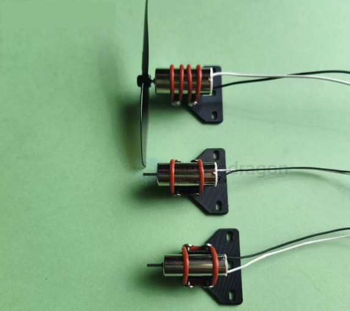
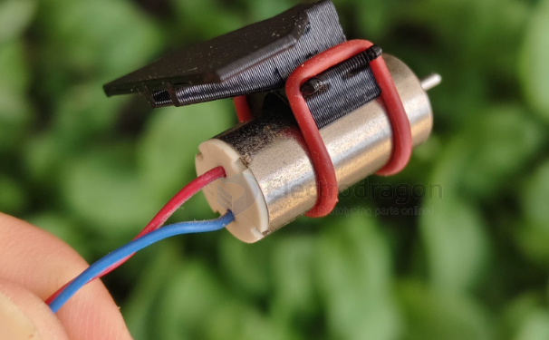

# Motor-brushed-Coreless-dat

- [[Motor-brushed-Coreless-dat]] - [[motor-dat]] - [[motor-brushed-dat]]

- [[motor-brushless-dat]] - [[Motor-brushed-Coreless-dat]]

## coreless vs brushless 

| Category                    | Brushless                                                                                          | Brushed (8520 / 615 Coreless)                                                                            |
| --------------------------- | -------------------------------------------------------------------------------------------------- | -------------------------------------------------------------------------------------------------------- |
| **Performance & Power**     | Significantly higher power-to-weight ratio, faster throttle response, explosive acceleration. Handles aggressive acrobatic maneuvers (freestyle / racing) effortlessly. | Sluggish throttle response and noticeable voltage sag under heavy bursts. Struggles with heavy HD cameras (Naked GoPro, full-weight O3/Walksnail setups). |
| **Durability & Lifespan**   | Highly durable. Electronic commutation (ESC) instead of physical carbon brushes, so no friction-worn parts. Motors last hundreds of flights unless physically damaged in a heavy crash. | Low lifespan. Physical brushes and commutators wear out over time (typically 10–30 hours of flight time), leading to power loss, motor failure, or constant replacements. |
| **Efficiency & Flight Time**| More efficient overall, giving crisper handling and better battery management under high loads.     | Less efficient, prone to generating heat quickly during aggressive flying, which reduces flight time.     |
| **Cost & Weight**           | Slightly heavier (separate ESC board) and more expensive to build or repair.                        | Extremely lightweight and cheap. Still used for ultra-micro indoor whoops (e.g. tiny 65mm builds) where minimum weight is the top priority. |

## motor mount 

- [[mount-dat]] - [[fixed-wing-dat]] - [[motor-brushed-coreless-dat]]

## types 

The **8520 motor** and **615 motor** are two different sizes of micro **coreless DC brush motors**. Their names are based on their physical dimensions (diameter and length):

## Motor Specifications Overview

- 1106
- 1104
- 1020 
- 8520
- 720 
- 615

**8520 Motor**: 8.5mm outer diameter × 20mm length. Typically runs on 3.7V (1S LiPo), reaching 40,000–50,000 RPM. Used in micro quadcopters, FPV Tiny Whoops, and mini RC toys.

**615 Motor**: 6.0mm outer diameter × 15mm length. Smaller, lighter, and lower torque. Used in ultra-miniature nano drones and tiny toy aircraft.**

* **Form factor & Application:** The 8520 provides significantly more thrust and power, making it the standard choice for larger micro drones (like 65mm–75mm brushed frames), whereas the 615 is reserved for ultra-lightweight, sub-miniature indoor flyers.
* **Voltage compatibility:** Both are commonly designed for single-cell lithium polymer (1S LiPo) power sources.

## Coreless Motors

**无刷电机（Brushless Motor, BLDC）**与**有刷空心杯电机（Coreless Motor / Brushed Coreless Motor）**是微型电机（如无人机、航模、机器人中常用）的两大主流技术路线。它们最大的区别在于**是否有电刷换向**以及**转子的结构设计**。

以下是两者的核心区别对比：

---

### 1. 结构与工作原理的区别

* **有刷空心杯电机 (Coreless Motor)**：
* **结构**：属于**有刷电机**的一种特殊变体。它最大的特点是**没有传统的铁芯转子**，而是采用斜绕组线圈组成一个像杯子一样的空心圆柱体（无铁芯结构）。电刷和换向器（Commutator）通过机械接触实时改变电流方向来驱动转子。
* **换向方式**：**机械换向**（依靠碳刷/电刷与换向片的物理摩擦接触）。

* **无刷电机 (Brushless Motor, BLDC)**：
* **结构**：转子是**永磁体**，定子是带有线圈绕组的硅钢片铁芯。
* **换向方式**：**电子换向**。依靠外部的电调（ESC）根据转子位置传感器（或无感反电动势）通过电子开关依次给定子线圈通电，产生旋转磁场来驱动转子。无物理电刷。

---

### 2. 性能与优缺点对比

| 比较维度           | 有刷空心杯电机 (Coreless)                                                  | 无刷电机 (Brushless)                                           |
| ------------------ | -------------------------------------------------------------------------- | -------------------------------------------------------------- |
| **效率与发热**     | **较高**（因无铁芯，转子惯量极小，响应极快；但存在电刷摩擦损耗）           | **极高**（无机械摩擦，没有电刷损耗，发热量相对较低）           |
| **寿命与维护**     | **较短**（电刷和换向片会磨损，需定期清理或更换电机）                       | **极长**（无电刷磨损，理论寿命仅取决于轴承寿命，基本免维护）   |
| **转速与动力**     | 适合**超高转速、微型轻量化**场景（如微型室内 FPV 穿越机的 0603/0702 电机） | 动力范围极广，从微型到超大功率均可，**输出扭矩和功率密度更大** |
| **电磁干扰 (EMI)** | **大**（电刷换向时会产生明显的电火花和电磁噪声，可能干扰无线射频）         | **小**（电子换向，无电火花，电磁干扰极低）                     |
| **控制复杂度**     | **简单**（只需直接给直流电即可旋转，调速只需改变电压或PWM）                | **复杂**（必须搭配专门的电子调速器/ESC，通过三相交流驱动）     |

---

### 3. 典型应用场景

* **有刷空心杯电机**：
* 常见于**超微型玩具无人机（如 Tiny Whoop 的 65mm 以下小飞机）**、微型航模舵机、电动牙刷、医疗微型泵、四轴玩具等对空间和重量极致苛刻、成本敏感的场景。

* **无刷电机**：
* 广泛应用于**现代主流 FPV 无人机（如视频中提到的 65mm-75mm 乃至大尺寸穿越机）**、航拍无人机、电动汽车、工业机器人、无人机云台、航模固定翼等需要高效率、大扭矩和长寿命的领域。

## ref 

