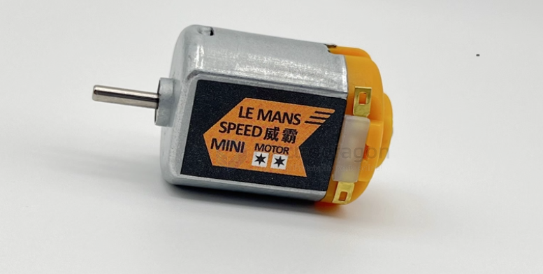
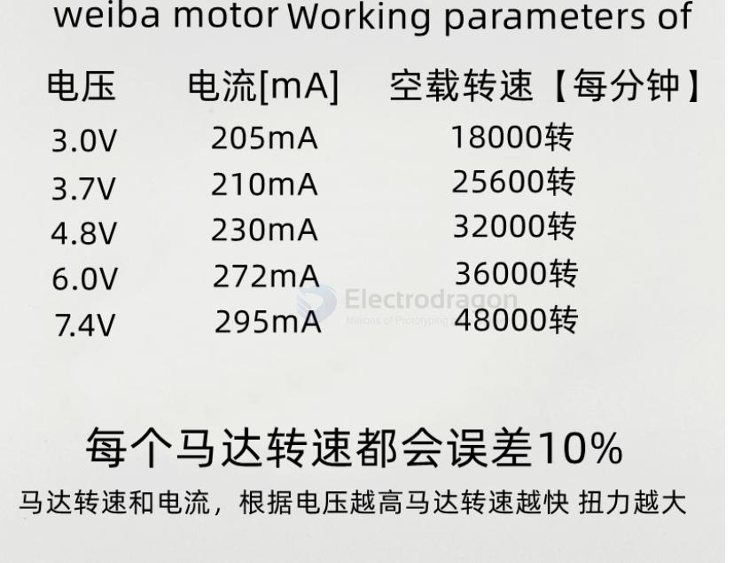
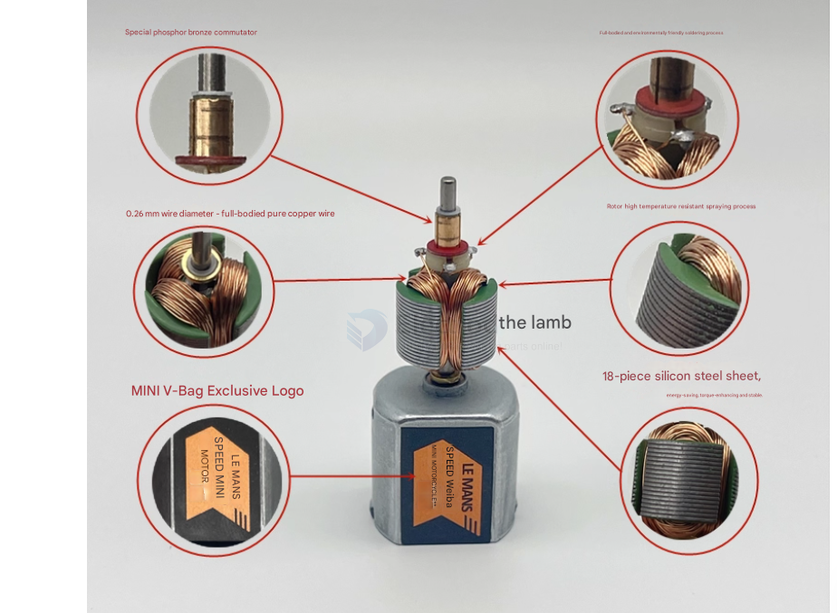

# motor-130-dat

## advanced 130 motor 

## info 

A **130 motor** is a standard miniature **brushed DC motor** widely used in toys, small robots, DIY electronics, and gearboxes. The "130" refers to the **size/form factor**, not a specific model. These motors are often interchangeable between brands.

**Common Applications:**
- Small wheeled robots
- Toy cars and fans
- Mini pumps
- DIY electronics and STEM projects

---

## Physical Dimensions (Typical)
| Parameter          | Typical Value                |
|-------------------|-----------------------------|
| Body Diameter      | ~20 mm                       |
| Body Length        | ~25–28 mm                     |
| Shaft Diameter     | ~2 mm                        |
| Shaft Length       | ~8–11 mm                     |
| Weight             | ~14–25 g                     |

---

## Electrical Specifications (Typical)
| Parameter                | Typical Range                        |
|---------------------------|--------------------------------------|
| Operating Voltage         | 1.5–12 V (common 3.7–6 V)           |
| Rated Voltage             | ~6 V                                 |
| No-Load Speed             | 9,000–20,000 RPM                     |
| No-Load Current           | 70–350 mA                             |
| Loaded Speed              | 4,500–10,000 RPM                      |
| Loaded Current            | 250–800 mA                             |
| Stall Current             | 500 mA up to several Amps             |
| Torque                    | 10–55 g·cm                            |
| Typical Load Torque       | ~10–55 g·cm                            |

---

## Operating Notes
- Current draw increases with load; low at no-load, very high at stall.
- Motors can overheat or burn if voltage exceeds rated value.
- Use a motor driver or PWM control for speed regulation and safe operation.
- Typical operating temperature: –10°C to +60°C

---

## Example Variants

### Standard Hobby Motor
- Voltage: ~6 V  
- No-load speed: ~9,100 RPM  
- No-load current: ≤70 mA  
- Loaded speed: ~4,500 RPM  
- Stall current: ~500 mA  
- Torque: ~10 g·cm  

### High-Speed / High-Power Variant
- Voltage: ~1.5–3 V (operable higher)  
- Free-run speed: ~20,000 RPM @ 3 V  
- Free-run current: ~350 mA  
- Stall current: ~4 A  
- Stall torque: ~55 g·cm  

---

**Summary Table**

| Feature           | Typical Range                       |
|------------------|-------------------------------------|
| Voltage           | 1.5–12 V (common 3.7–6 V)          |
| No-Load Speed     | 9,000–20,000 RPM                     |
| No-Load Current   | 70–350 mA                             |
| Loaded Current    | 250–800 mA                             |
| Stall Current     | ~500 mA to several Amps              |
| Torque            | 10–55 g·cm                            |
| Size              | ~20 × 25–28 mm                        |
| Weight            | 14–25 g                               |

## ref 

- [[motor-brushed-dat]]