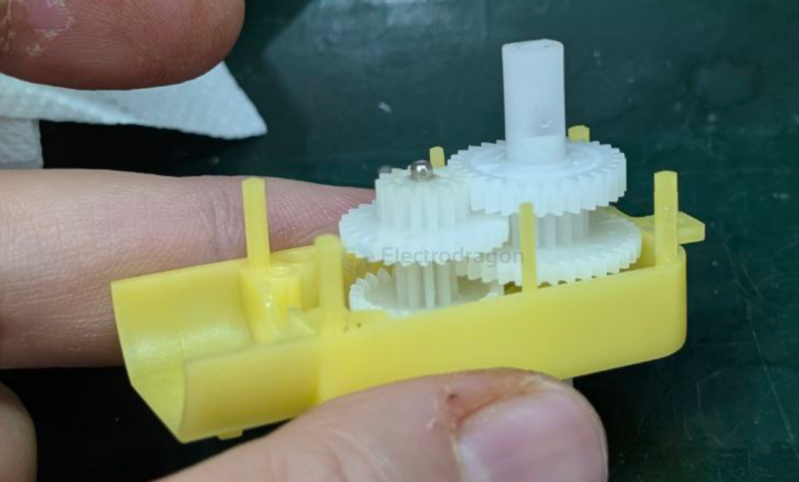
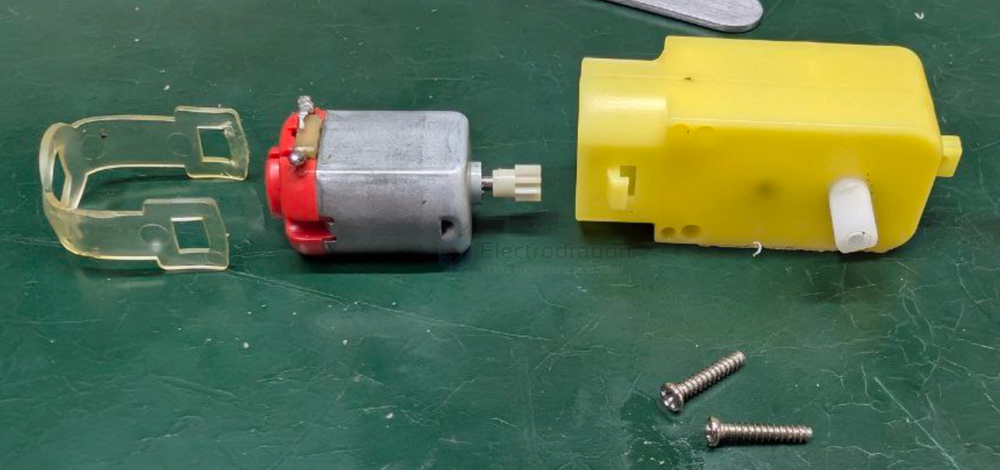
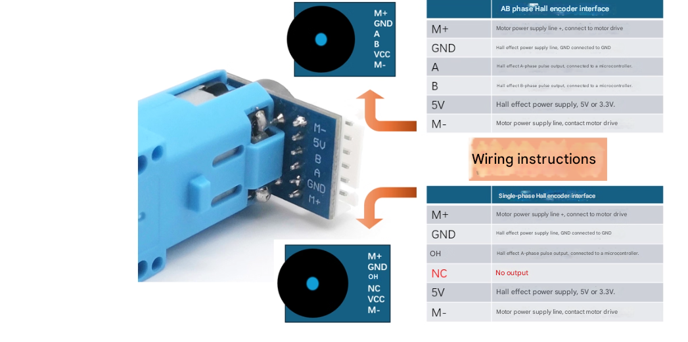

# motor-TT-dat

A TT motor is a type of DC motor commonly used in hobbyist robotics and DIY electronics projects. It's characterized by its yellow plastic gearbox and is often paired with a plastic wheel.

based on motor [[motor-130-dat]]

## specs 

- [[shaft-dat]] == single /dual shaft

- [[gearbox-dat]] 
  - plastic
  - metal

- reduction ratio == 1:48 / 1:90 / 1:120 / 1:220

## TT motor with hall sensor 

- [[sensor-hall-dat]]

## dimension 

## Key features mentioned include:

- Gearbox: It typically has a plastic gearbox, often with a 1:48 or 1:120 gear ratio.
- Voltage: Operates at voltages like 3V, 5V, or 6V.
- Current:
  - No-load current is around 150mA at 3V and 170mA at 6V.
  - Stall current can be around 0.8A at 3V and up to 1.3A or 2.8A at 6V depending on the specific model.
- Speed: No-load speed varies with voltage and gear ratio (e.g., 90-100 RPM at 3V, 180-250 RPM at 6V).
- Torque: Stall torque is also voltage and gear ratio dependent (e.g., 0.8 kg.cm).
- Shaft: Often has a dual shaft design.
- EMF: Some versions may have built-in electromagnetic shielding or capacitors for EMF suppression.

## ref 

- [[dc-gear-motor-dat]]