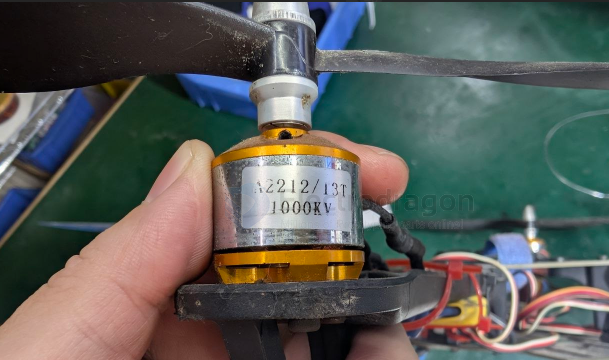

# A2212-dat

- [[F450-dat]] - [[F550-dat]] 

- [[EX1103-dat]] - [[A2212-dat]] - [[motor-FPV-dat]] - [[motor-brushless-dat]] - [[ESC-dat]]

### A2212 13T 1000KV Motor Technical Specifications

| Parameter | Specification |
| :--- | :--- |
| **Motor Type** | Outrunner Brushless Motor |
| **Dimensions (Bell)** | 27.5 mm × 27 mm |
| **Shaft Diameter** | 3.17 mm (1/8") |
| **Weight** | ~52.7 g |
| **KV Rating** | 1000 RPM / Volt |
| **Winding Turns (13T)** | 13 Turns (High-Torque Configuration) |
| **Poles** | 14P |
| **Operating Voltage** | 2S – 3S LiPo (7.4V – 11.1V) |
| **Max Continuous Current** | 12A / 60s |
| **Max Power Output** | ~150 Watts |
| **Recommended ESC** | 20A – 30A Brushless ESC |

---

### Thrust & Propeller Performance (tested @ 3S 11.1V)

| Propeller Size | Max Current (A) | Single Motor Max Thrust | Efficiency / Notes |
| :--- | :--- | :--- | :--- |
| **10×4.5 (1045)** | **~11.0 A – 13.0 A** | **~800 g** | **Sweet Spot.** Max thrust for F450 quadcopters & trainers. |
| **9×4.7 (0947)** | **~7.5 A – 9.0 A** | **~600 g** | High efficiency; smooth cruising. |
| **8×4.5 (0845)** | **~5.5 A – 7.0 A** | **~450 g** | Under-propped; runs cool with lower thrust output. |

---

### Key Applications & Capabilities

* **F450 Quadcopter Quad-Setup:** 4x motors produce **~3.2 kg total peak thrust** (hovers a 1kg quadcopter at ~30% throttle).
* **RC Fixed-Wing Planes:** Ideal powerplant for 300g–800g park flyers, high-wing trainers, and scale gliders.

## ref 

