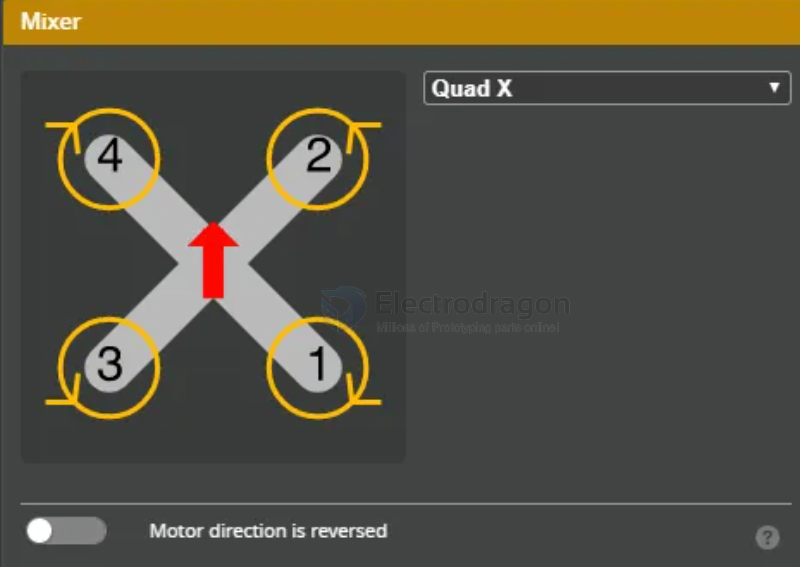
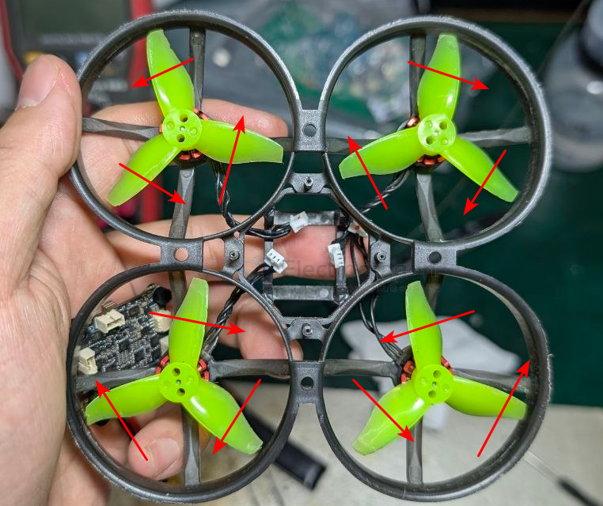
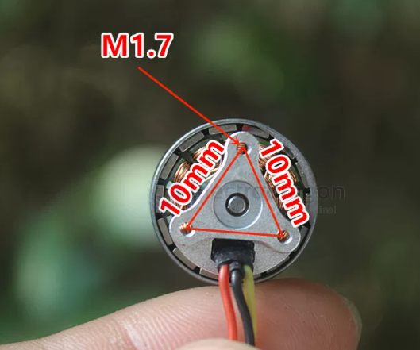
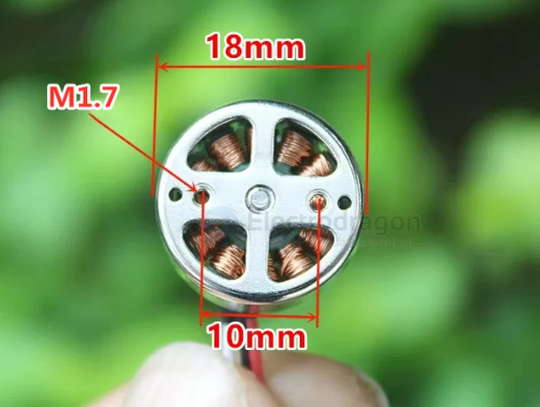
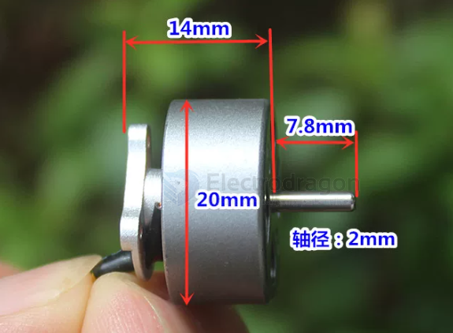
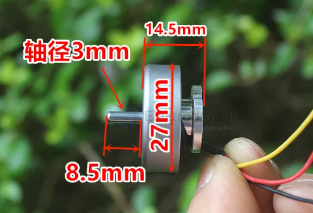
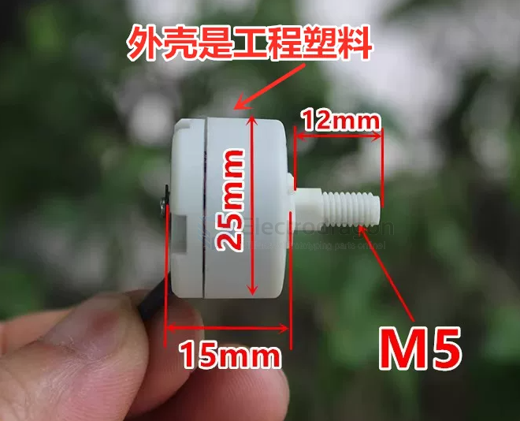

# motor-FPV-dat

- [[motor-FPV-dat]] - [[propeller-FPV-dat]]

- [[motor-brushless-dat]] - [[motor-FPV-dat]] - [[motor-FPV-mount-dat]] 

- [[FPV-build-dat]] - [[FPV-frame-dat]] - [[flight-controller-dat]] - [[motor-FPV-dat]] - [[propeller-FPV-dat]] - [[camera-FPV-dat]]

- [[motor-FPV-dat]] - [[DJI-neo-dat]]

- [[motor-dat]]

- [[motor-coreless-dat]] - [[propeller-dat]]

- [[ESC-dat]] - [[motor-FPV-dat]] - [[propeller-FPV-dat]]

- [[betaflight-dat]]

## installation 

- [[quadcopter-dat]] - [[FPV-dat]] - [[motor-FPV-dat]]

### option normal - prop in 

see [[mobula8-dat]] 

- motor 1 RR == 2023R CCW 
- motor 2 FR == 2023 CW
- motor 3 RL == 2023 CW
- motor 4 FL == 2023R CCW

### option reversed - prop out 

- motor 1 RR == 2023 CW 
- motor 2 FR == 2023R CCW
- motor 3 RL == 2023R CCW
- motor 4 FL == 2023 CW

visual setup 

          机头（前）
    motor4            motor2
    CW ↻            CCW ↺

    motor3            motor1
    CCW ↺           CW ↻
          机尾（后）

## type by size 

### type 1106 

6～12A电调

### type 1306 

6～12A电调 == 10A 四寸桨 - [[ESC-dat]] - [[motor-FPV-dat]] - [[propeller-FPV-dat]]

### 1503 

2150KV

### types 1504 

- 1x 1504 2300KV (4 mounting holes)
- 4x 1504 2300KV a set (4 mounting holes)
- 4x 1504 2300KV + insurance a set (4 mounting holes)

- 1x 1504 3600KV (4 mounting holes)
- 4x 1504 3600KV a set (4 mounting holes)
- 4x 1504 3600KV + insurance a set (4 mounting holes)

- 1x 1504 3800KV (3 mounting holes)
- 4x 1504 3800KV a set (3 mounting holes)
- 4x 1504 3800KV + insurance a set (3 mounting holes)

- [Benefits [and down sides] of HIGHER PWM Frequency! 🙀💪](https://www.youtube.com/watch?v=v3806Incpvo)

### type 1605 

2200KV 

### types 220x

2204/2205 motor轴直径 = 3mm 或 3.17mm（标准）

2204 - 1000KV

2212

2216 

1400KV / 980KV / 1250KV 

10寸浆 推荐3s 2200

### 2515 

1880KV / 6045螺旋桨用2S电池

### 2616 

1550KV

## identify the motor directions 

⭐️ 关键：把滑块调到"刚好能转"的最低值 —— motor页的滑块可以拖到很慢。

方法 2：手机慢动作录像 ⭐️

1. motor低速转
2. 手机开【慢动作 120/240fps】录 2 秒
3. 回放 → 方向一目了然

## How to Reverse a 3-Wire Brushless Motor

### 1. Identify the motor wires

- Typically **3 wires** connected to ESC  
- Colors may vary → A, B, C (or random colors)  

---

### 2. Swap any **two wires**

- Example: swap **A and B**, leave C unchanged  
- This reverses motor rotation direction  

## how to prevent motor burning

- Don’t run **96 kHz** unless you’re sure your ESC can handle it.  
- Set **Motor Idle Throttle ~6%** to prevent stalling.  
- Keep an eye on **motor temperature after indoor flights** (touch test). Warm = ok, too hot to touch = dangerous.  
- Avoid flying with props bent / rubbing ducts indoors (adds load).  

## What Does 1400KV Mean in an FPV Motor?

In FPV drones, **KV** is a motor specification that indicates the motor’s speed constant.  

---

### ⚡ Definition of KV
- **KV (RPM/Volt)** = How many **Revolutions Per Minute (RPM)** the motor will spin **per 1 Volt applied**, without any load (no propeller).  

For example:  
- A **1400KV motor** spins **1400 RPM per Volt**.  
- If powered by a **4S LiPo (14.8 V)**:  
  
    1400 KV × 14.8 V ≈ 20,720 RPM (no load)

### 🔧 What It Means in Practice

1. **Lower KV (e.g., 1400KV)**
 - Spins slower per volt.
 - Provides more **torque** (good for larger props, longer flight times, heavy drones, cinewhoops).
 - Better for **efficiency** and carrying loads.

2. **Higher KV (e.g., 2800KV, 4000KV)**
 - Spins faster per volt.
 - Provides less torque, but more **speed**.
 - Good for **small props, racing, and high agility**.

---

### 🛠️ Typical Use Cases
- **1400KV motors** are usually found on:
- **Cinewhoops** with 3–5 inch props.
- **Long-range FPV drones** where efficiency and endurance matter.
- Drones designed to carry heavier cameras (e.g., GoPro).

---

### ✅ **Summary**:  
A **1400KV FPV motor** means the motor spins about **1400 RPM per volt** (unloaded). It is a **low-KV motor** designed for **larger props, more torque, and efficiency**, rather than raw speed.

## QA 

用户问：四旋翼的四个motor都是同一个型号的么？

⭐️ 答案：**是的，通常都是同一型号**（4 个相同motor）。

原因：
1. **推力平衡**：4 个motor必须推力一致，否则飞控难以平衡（姿态失控/倾斜）
2. **KV 值一致**：转速响应必须相同
3. **重量一致**：质心平衡
4. 生产上：出厂即配 4 个相同的（有些品牌会标注"匹配组"）

## ref 

- [[FPV]] - [[FPV-motor]]