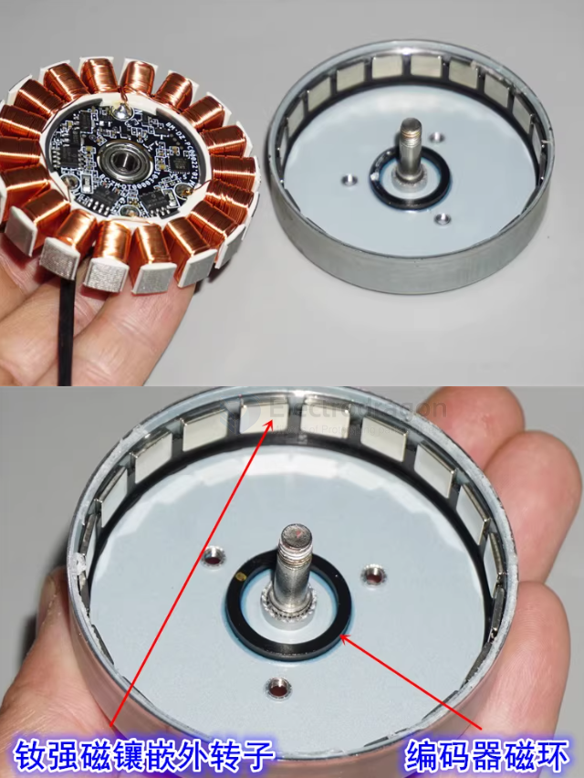

# motor-brushless-dat.md

- [[DRV8301-dat]] - [[ESC-dat]] - [[FOC-dat]] - [[motor-brushless-dat]] - [[motor-driver-BLDC-dat]]

- [[motor-brushless-dat]] - [[motor-driver-BLDC-dat]] - [[motor-driver-dat]] - [[motor-dat]]

== BLDC [[motor-BLDC-dat]]

- [[Imperial-dat]]

- [[motor-dat]] - [[motor-brushless-dat]] - [[ruiyi-dat]]

- [[gear-dat]] - [[thread-dat]]
[[motor-BLDC-driver-dat]]
- [[sensor-hall-dat]] 

- [[motor-BLDC-driver-dat]] - [[motor-brushless-dat]] - [[motor-driver-dat]] - [[motor-dat]]

- [[ESC-dat]] - [[motor-brushless-dat]]

- [[EX1103-dat]] - [[motor-dat]] - [[Thrust-dat]] - [[motor-FPV-dat]] 

## app 

- [[mobula8-dat]] - [[mobula7-dat]] - [[mobula6-dat]] - [[FPV-dat]] - [[motor-brushless-dat]]

## board 

- [[SDR1106-dat]]

## specs 

- [[EX1103-dat]] 

## The Breakdown: 9N12P

### **9N = 9 Slots (定子槽数)**
* **What it means:** The **N** stands for **Number of Slots** (or poles/teeth) on the stationary part of the motor (the stator). These are the copper-wire-wound iron cores that create electromagnetic fields when current passes through them.
* **Characteristics:** A 9-slot stator has 9 distinct electromagnets arranged radially.

### **12P = 12 Poles (转子磁极数)**
* **What it means:** The **P** stands for **Number of Permanent Magnet Poles** on the rotating part of the motor (the rotor). 
* **Crucial Note:** This refers to the *total number of individual magnetic poles* (North and South poles counted separately), **not** pole pairs. 
* **Characteristics:** A 12P motor has 12 permanent magnets arranged around the rotor (alternating North-South-North-South). This is equivalent to **6 Pole Pairs**.

---

### Why This Configuration Matters

The ratio of slots (N) to poles (P) determines the motor’s running characteristics, winding factor, and structural efficiency. 

#### 1. Winding Factor & Efficiency
A **9N12P** configuration is a classic, highly efficient combination. Because 9 and 12 share a common factor, it allows for a concentrated fractional-slot winding layout (usually using an **AabBCcaAB** or similar winding scheme). This results in a high winding factor, meaning the motor converts electrical energy into magnetic torque very efficiently.

#### 2. Smoothness and Cogging Torque
The relationship between slots and poles determines the **Cogging Torque** (the bumpy resistance you feel when turning the motor by hand while it's powered off). 
* The frequency of the cogging torque is determined by the `Least Common Multiple (LCM)` of the slots and poles. 
* For 9 and 12, $\text{LCM}(9, 12) = 36$. 
* A higher LCM means the cogging torque steps are distributed finely across a single rotation, resulting in **lower cogging vibration, smoother low-speed rotation, and quieter operation**.

What Does an LCM of 12 Mean in Practice?

This means the motor will experience exactly **12 cogging torque steps (or "clicks") per complete $360^\circ$ mechanical revolution**. 

Compared to the 9N12P motor we looked at earlier ($\text{LCM} = 36$), a 6N12P motor behaves very differently:

#### 🔴 High Cogging Torque (Rougher Rotation)
Because the LCM is so low (12 vs 36), the magnetic alignments repeat much less frequently but with much greater force. When you turn a 6N12P motor by hand, you will feel **strong, highly distinct, distinct "notches" or bumps**. 

#### 🔴 Poorer Low-Speed Smoothness
An LCM of 12 means the cogging transitions are wide apart ($30^\circ$ of mechanical rotation per step). At very low speeds, the motor will struggle to rotate smoothly and may exhibit noticeable jitter or vibration (often called "cogging") unless managed by an exceptionally high-end Field-Oriented Control (FOC)電调.

#### 🟢 Easy/Symmetrical Winding
On the hardware side, because the pole count is exactly double the slot count ($12 = 2 \times 6$), the winding scheme is incredibly straightforward (typically a simple alternate **A-B-C-A-B-C** or concentrated all-teeth winding).

Quick Comparison

| Motor Configuration | LCM (Cogging Steps/Rev) | Feel When Turned by Hand | Low-Speed Smoothness |
| :--- | :--- | :--- | :--- |
| **9N12P** | **36** | Tight, fine, smooth clicks | Very Smooth (Great for Gimbals/Robotics) |
| **6N12P** | **12** | Heavy, clunky, wide notches | Rougher (Requires high-frequency FOC to smooth out) |

#### 3. High Torque Density
Because the pole count (12P / 6 pole pairs) is relatively high for a 9-slot stator, this configuration is excellent for producing **high torque at lower RPMs**. It is commonly found in gimbal motors, small outrunner drone motors, and robotics actuators where torque density and smoothness are prioritized over extreme top-end speeds.

The core parameters of a brushless motor (BLDC / PMSM) directly determine its torque, speed, heat generation, and requirements for the electronic speed controller (ESC) and power supply. When selecting or debugging a motor, the following major parameters are the most critical:

---

### 1. Core Electrical & Mechanical Parameters

#### **KV Rating (RPM/V, Motor Velocity Constant)**
* **Definition:** The number of revolutions per minute (RPM) that the motor turns when a **1V** potential is applied with no load.
  $$\text{No-Load RPM} = \text{KV Rating} \times \text{Working Voltage}$$
* **Characteristics:**
  * **High KV:** Fewer turns of thicker wire. It has low internal resistance and is ideal for lower voltages with smaller propellers or low gear ratios, aiming for **extreme speed** (e.g., racing drones, high-speed fans).
  * **Low KV:** More turns of thinner wire. It has higher internal resistance and is ideal for higher voltages with larger propellers or high gear ratios, aiming for **high torque/thrust** (e.g., aerial photography drones, robotic joints, direct-drive systems).

#### **Pole Pairs**
* **Definition:** The number of **magnetic pole pairs** formed by the permanent magnets on the rotor (Note: Number of Poles = 2 × Pole Pairs). For example, a "14P" motor has 14 magnetic poles, which equals 7 pole pairs.
* **Impact:**
  * More pole pairs generally increase the torque density (higher low-speed torque), but the ESC must switch the current phase at a much higher frequency (electrical frequency):
    $$\text{Electrical Frequency} = \text{Mechanical RPM} \times \frac{\text{Pole Pairs}}{60}$$
  * At very high RPMs, an excessively high pole pair count demands substantial processing power and rapid commutation capability from the ESC.

#### **Internal Resistance (Phase Resistance / $R_m$)**
* **Definition:** The DC resistance measured between the motor phases (typically in milliohms, $\text{m}\Omega$).
* **Impact:** Internal resistance directly dictates the heat generated by the motor (copper loss, $I^2R$) and its overall efficiency. Lower internal resistance means less heat generation under high current loads, higher efficiency, and greater maximum output power.

#### **No-Load Current ($I_0$)**
* **Definition:** The current consumed by the motor when rotating freely at its rated voltage with zero external load.
* **Impact:** This current is primarily spent overcoming internal mechanical friction and iron losses (hysteresis and eddy current losses). A lower $I_0$ indicates better mechanical precision and magnetic circuit design, yielding higher efficiency under light loads.

---

### 2. Power & Limit Parameters

#### **Max Continuous Current**
* **Definition:** The maximum current the motor can safely handle for an extended period under proper airflow and cooling conditions.
* **Impact:** Exceeding this threshold for too long causes excessive heat, which can melt the winding insulation (burning out the motor) or permanently demagnetize the permanent magnets.

#### **Max Continuous Power**
* **Definition:** The maximum power input or output ($W = V \times I$) the motor can sustain safely.
* **Selection Guide:** It is standard practice to select a motor that provides a **20% - 50%** safety margin above the calculated power requirement of the intended application.

#### **Max Voltage / LiPo Cells**
* **Definition:** The maximum input voltage permitted by the motor's insulation rating and bearing RPM limits. It is commonly specified by the maximum number of lithium polymer battery cells supported (e.g., 2S-4S, 6S, 12S).

---

### 3. Common Model Naming Standard

Most brushless motors (especially outrunner styles used in hobby electronics and robotics) utilize a 4-digit naming convention (e.g., **2212** or **2807**):

* **First Two Digits:** Indicate the **Stator Core Diameter** in millimeters.
* **Last Two Digits:** Indicate the **Stator Core Height** in millimeters.

> ⚠️ **Note:** A larger stator size can accommodate more copper wire turns and larger magnets, yielding higher torque and power capacity. However, a few manufacturers (like some RC car motor brands) use the external outer dimensions of the motor housing instead. Always cross-check the official technical drawing during selection.

---

### 4. Sensor Interface Types

* **Sensorless:** The motor does not contain internal position sensors. The ESC relies on detecting the Back Electromotive Force (Back-EMF) from the unpowered phase to determine rotor position. This design is robust, waterproof, and mechanically simple, but it is prone to **cogging/jitter at zero speed or during low-speed startup**.
* **Sensored:** The motor integrates **Hall-effect sensors** or a high-resolution **encoder**. The ESC knows the exact rotor position even at a complete standstill. This setup delivers **massive low-speed torque and exceptionally smooth startup**, making it indispensable for industrial automation, robotic arms, servo control systems, and precision low-speed drivetrains.

### 🛴 Scooter BLDC Comparison: Weight vs. Performance

| Motor Weight     | Typical Power | Ideal Voltage | Estimated RPM | Torque Profile                     |
| :--------------- | :------------ | :------------ | :------------ | :--------------------------------- |
| **200g (Drone)** | 300W          | 11.1V         | 15,000+       | Low (Needs 15:1 Gearbox)           |
| **600g (Mid)**   | 750W          | 24V           | 6,000         | Medium (Needs 5:1 Gearbox)         |
| **3000g (Hub)**  | 1000W         | 36V           | 400 - 600     | **High (Direct Drive - No Gears)** |

## control methods 

- [[ESC-dat]]

- [[sensor-hall-dat]]

- [[simpleFOC-dat]] 

- [[FOC-dat]]

## specs 

- sensored / sensorless
- outrunner / inrunner
- brushless / brushed

- Advanced ESCs use **Field-Oriented Control (FOC)** or **sensored feedback** for smooth torque at low RPM, perfect for crawlers.  

## types 

- 3525
- 3650
- 3660
- 4274

## specs 

| Feature        | Details                                       |
| -------------- | --------------------------------------------- |
| **Power**      | 500W – 3000W+ (easily scalable)               |
| **Voltage**    | 24V – 72V (often used with Li-ion or LiFePO4) |
| **Torque**     | Higher torque with good efficiency            |
| **Efficiency** | 80–90% (vs 60–70% for brushed)                |
| **Lifespan**   | Much longer (no brushes = low wear)           |
| **Control**    | Needs ESC (Electronic Speed Controller)       |

BLDC stands for Brushless DC Motor. It is a type of electric motor that operates without brushes, unlike traditional brushed DC motors. BLDC motors are more efficient, durable, and generate less noise because they use electronic commutation instead of mechanical brushes.

Key Features of BLDC Motors:

- Higher Efficiency: Less energy loss compared to brushed motors.
- Longer Lifespan: No brushes mean less wear and tear.
- Low Maintenance: No brush replacements needed.
- Better Speed Control: Precise control using electronic circuits.
- Less Heat & Noise: Smooth operation with minimal friction.

Common Applications:

- Electric Vehicles (EVs)
- Drones
- Cooling Fans
- Air Conditioners
- Power Tools
- Industrial Automation

## BLDC motor with Hall sensors

### Hall Sensor Brushless Motor (有感无刷有霍尔马达)

A "**Hall Sensor Brushless Motor**" (有感无刷有霍尔马达) refers to a **BLDC motor with Hall sensors**, also known as a **sensored BLDC motor**.  

#### Explanation  
- **Brushless (BLDC):** The motor operates without carbon brushes, using electronic commutation, making it more durable and efficient than brushed motors.  
- **Sensored (Hall Sensors):** The motor has **Hall effect sensors** that detect the rotor's position, enabling precise commutation signals. This ensures **smooth operation, better torque control, and easier startup** compared to sensorless BLDC motors.  

#### Comparison: Sensored vs. Sensorless BLDC Motors  

| **Type**                | **Sensored BLDC (With Hall Sensors)**           | **Sensorless BLDC (Without Hall Sensors)**           |
| ----------------------- | ----------------------------------------------- | ---------------------------------------------------- |
| **Startup Performance** | Smooth startup, stable at low speeds            | Difficult startup, vibrations at low speed           |
| **Control Complexity**  | Easier control, good for high-load applications | Requires advanced algorithms                         |
| **Common Applications** | E-bikes, electric scooters, industrial tools    | High-speed, low-load applications like drones & fans |

#### Typical Applications  

- **Electric Vehicles (E-bikes, E-scooters):** Requires smooth low-speed control and high torque.  
- **Industrial Automation:** Used in robotics, CNC machines, and power tools.  
- **Home Appliances:** Found in inverter air conditioners and high-end fans.  

- [[sensor-hall-dat]]

## compare brushed motor 

相比 普通有刷直流电机（Brushed DC Motor），BLDC 电机更耐用且效率更高，但需要电子控制器才能工作。

## Centrifugal Pump hack 

🛠️ DIY Hack: ZL4815 Pump Motor to Scooter Drive

| Component        | Hack/Solution                                     | Why it's needed                                              |
| :--------------- | :------------------------------------------------ | :----------------------------------------------------------- |
| **Shaft Prep**   | Grind a **D-Flat** or use a **Threaded Adapter**. | Prevents the 10T sprocket from slipping under load.          |
| **Transmission** | **1:5 Ratio** (10T Motor / 50T Wheel).            | Converts high RPM to useful torque for a human.              |
| **Linkage**      | #25 or T8F Steel Chain.                           | Belts will snap; strings/wires will not work.                |
| **Cooling**      | Keep the **Air Inlets/Outlets** open.             | This motor is Class F; it needs its internal fan to breathe. |
| **Load Support** | Use a **Pillow Block Bearing** on the shaft.      | Protects the motor bearings from the chain's tension.        |

## internal of a brushelss motor 

single direction control mechanism 

## brushless motor with hall sensor for mobility 

- A 款电机引线长 ：大约 800 MM
- A 款电机重量 :2.573 KG
- B 款电机引线长 ：大约 80 MM
- B 款电机重量 ：2.429 KG
- （电机的外壳尺寸基本一样）
- 我们用一款小无刷电机驱动电机（八线）驱动电机，实测转速和电流如下：
- 电压 ：DC30V
  - 空载电流 :0.91 A
  - 空载最高转速 :304 RPM
- 电压 ：DC36V
  - 空载电流 :1 A
  - 空载最高转速 :365 RPM
- 电压 ：DC42V
  - 空载电流 :1.1 A
  - 空载最高转速 :426 RPM
- 电压 ：DC48V
  - 空载电流 :1.2 A
  - 空载最高转速 :485 RPM

## apps 

- [[electric-scooter-dat]] - [[roller-dat]]

## ref 

- [[motor-dat]] 

- [[BLDC]]

# Three-Phase BLDC Motor Data

The common three thick motor wires (yellow, green, blue) found on electric scooters are actually:

## ✅ Brushless DC Motor (BLDC) or Permanent Magnet Synchronous Motor (PMSM)

Also known as:

- Three-phase brushless motor
- Hub Motor
- Brushless DC Motor

These three wires are the motor's three-phase power lines, used by the controller to drive the motor's rotation.

## 🔍 Structure Features of Three-Wire Motors in Electric Scooters

### 1️⃣ Three-phase windings (U / V / W phases)

The usual colors are: yellow, green, blue

These three phases are commutated in sequence to make the motor spin.

### 2️⃣ Permanent magnet rotor (magnets inside the wheel)

The center is the rotor (with magnets).

Bicycles and scooters both use hub-type structures.

### 3️⃣ Stator on the outer ring of the coil

The motor is an outer rotor structure (the shell rotates).

The stationary part is inside the coil.

## ⚡ Why are there only three thick wires? Isn't that too few?

It's not too few, because:

These three wires are the power wires.

Some motors also have Hall sensors (5 thin wires).

Electric scooters usually have two types:

| Type                | Number of Wires         | Features                                 |
|---------------------|------------------------|------------------------------------------|
| Sensorless BLDC     | Only 3 thick wires     | Starts by induction, more vibration at low speed |
| With Hall PMSM/BLDC | 3 thick + 5 thin wires | Smooth start, suitable for FOC control    |

## 🛴 Why do electric scooters use three-phase brushless motors?

Because the advantages are obvious:

- High torque
- High efficiency
- Silent operation
- Maintenance-free (brushless, no wear)
- Simple structure (directly integrated in the wheel)

Almost all modern scooters (Xiaomi, Ninebot, Kaabo, etc.) use this type.

## gallery 

## ref 

- [[motor-BLDC-dat]] - [[motor-hub-dat]]

- [[motor-brushless]] - [[2nd]]