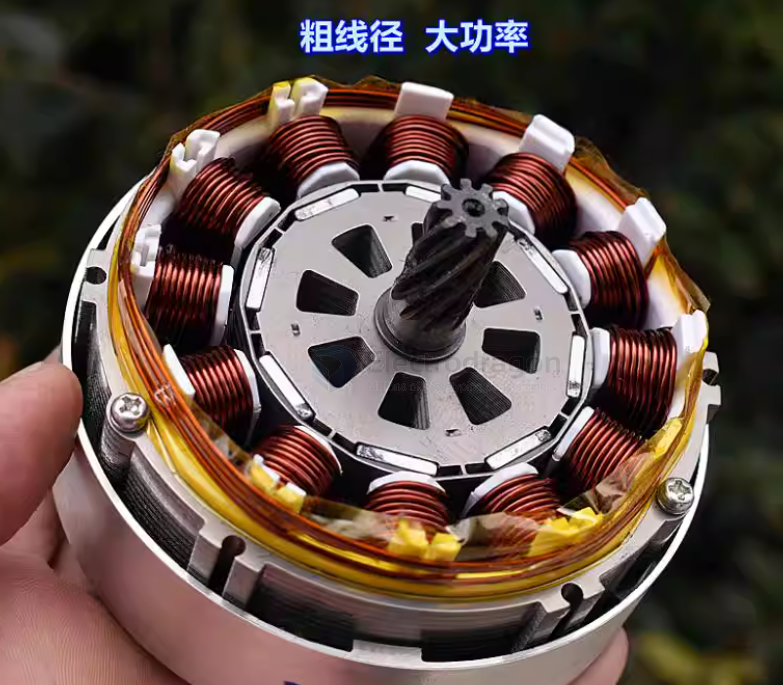
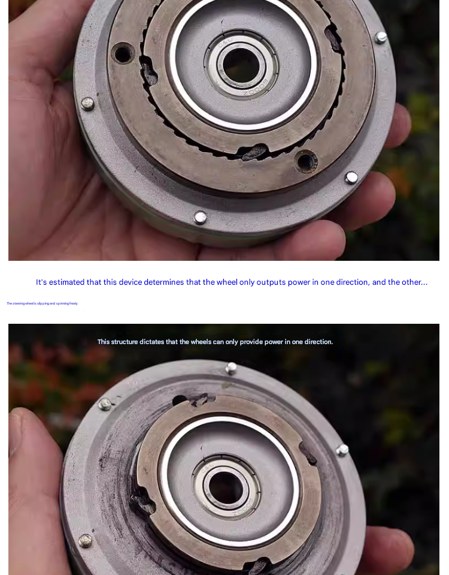
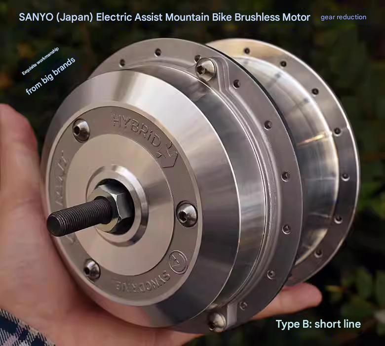

# motor-brushless-dat.md

== BLDC [[motor-BLDC-dat]]

- [[Imperial-dat]]

- [[motor-dat]] - [[motor-brushless-dat]] - [[ruiyi-dat]]

- [[gear-dat]] - [[thread-dat]]

- [[sensor-hall-dat]] 

- [[motor-BLDC-driver-dat]] - [[motor-brushless-dat]] - [[motor-driver-dat]] - [[motor-dat]]

## board 

- [[SDR1106-dat]]

## specs 

### 🛴 Scooter BLDC Comparison: Weight vs. Performance

| Motor Weight     | Typical Power | Ideal Voltage | Estimated RPM | Torque Profile                     |
| :--------------- | :------------ | :------------ | :------------ | :--------------------------------- |
| **200g (Drone)** | 300W          | 11.1V         | 15,000+       | Low (Needs 15:1 Gearbox)           |
| **600g (Mid)**   | 750W          | 24V           | 6,000         | Medium (Needs 5:1 Gearbox)         |
| **3000g (Hub)**  | 1000W         | 36V           | 400 - 600     | **High (Direct Drive - No Gears)** |

## control methods 

- [[ESC-dat]]

- [[sensor-hall-dat]]

- [[simpleFOC-dat]] 

- [[FOC-dat]]

## specs 

- sensored / sensorless
- outrunner / inrunner
- brushless / brushed

- Advanced ESCs use **Field-Oriented Control (FOC)** or **sensored feedback** for smooth torque at low RPM, perfect for crawlers.  

## types 

- 3525
- 3650
- 3660
- 4274

## specs 

| Feature        | Details                                       |
| -------------- | --------------------------------------------- |
| **Power**      | 500W – 3000W+ (easily scalable)               |
| **Voltage**    | 24V – 72V (often used with Li-ion or LiFePO4) |
| **Torque**     | Higher torque with good efficiency            |
| **Efficiency** | 80–90% (vs 60–70% for brushed)                |
| **Lifespan**   | Much longer (no brushes = low wear)           |
| **Control**    | Needs ESC (Electronic Speed Controller)       |

BLDC stands for Brushless DC Motor. It is a type of electric motor that operates without brushes, unlike traditional brushed DC motors. BLDC motors are more efficient, durable, and generate less noise because they use electronic commutation instead of mechanical brushes.

Key Features of BLDC Motors:

- Higher Efficiency: Less energy loss compared to brushed motors.
- Longer Lifespan: No brushes mean less wear and tear.
- Low Maintenance: No brush replacements needed.
- Better Speed Control: Precise control using electronic circuits.
- Less Heat & Noise: Smooth operation with minimal friction.

Common Applications:

- Electric Vehicles (EVs)
- Drones
- Cooling Fans
- Air Conditioners
- Power Tools
- Industrial Automation

## BLDC motor with Hall sensors

### Hall Sensor Brushless Motor (有感无刷有霍尔马达)

A "**Hall Sensor Brushless Motor**" (有感无刷有霍尔马达) refers to a **BLDC motor with Hall sensors**, also known as a **sensored BLDC motor**.  

#### Explanation  
- **Brushless (BLDC):** The motor operates without carbon brushes, using electronic commutation, making it more durable and efficient than brushed motors.  
- **Sensored (Hall Sensors):** The motor has **Hall effect sensors** that detect the rotor's position, enabling precise commutation signals. This ensures **smooth operation, better torque control, and easier startup** compared to sensorless BLDC motors.  

#### Comparison: Sensored vs. Sensorless BLDC Motors  

| **Type**                | **Sensored BLDC (With Hall Sensors)**           | **Sensorless BLDC (Without Hall Sensors)**           |
| ----------------------- | ----------------------------------------------- | ---------------------------------------------------- |
| **Startup Performance** | Smooth startup, stable at low speeds            | Difficult startup, vibrations at low speed           |
| **Control Complexity**  | Easier control, good for high-load applications | Requires advanced algorithms                         |
| **Common Applications** | E-bikes, electric scooters, industrial tools    | High-speed, low-load applications like drones & fans |

#### Typical Applications  

- **Electric Vehicles (E-bikes, E-scooters):** Requires smooth low-speed control and high torque.  
- **Industrial Automation:** Used in robotics, CNC machines, and power tools.  
- **Home Appliances:** Found in inverter air conditioners and high-end fans.  

- [[sensor-hall-dat]]

## compare brushed motor 

相比 普通有刷直流电机（Brushed DC Motor），BLDC 电机更耐用且效率更高，但需要电子控制器才能工作。

## Centrifugal Pump hack 

🛠️ DIY Hack: ZL4815 Pump Motor to Scooter Drive

| Component        | Hack/Solution                                     | Why it's needed                                              |
| :--------------- | :------------------------------------------------ | :----------------------------------------------------------- |
| **Shaft Prep**   | Grind a **D-Flat** or use a **Threaded Adapter**. | Prevents the 10T sprocket from slipping under load.          |
| **Transmission** | **1:5 Ratio** (10T Motor / 50T Wheel).            | Converts high RPM to useful torque for a human.              |
| **Linkage**      | #25 or T8F Steel Chain.                           | Belts will snap; strings/wires will not work.                |
| **Cooling**      | Keep the **Air Inlets/Outlets** open.             | This motor is Class F; it needs its internal fan to breathe. |
| **Load Support** | Use a **Pillow Block Bearing** on the shaft.      | Protects the motor bearings from the chain's tension.        |

## internal of a brushelss motor 

single direction control mechanism 

## brushless motor with hall sensor for mobility 

- A 款电机引线长 ：大约 800 MM
- A 款电机重量 :2.573 KG
- B 款电机引线长 ：大约 80 MM
- B 款电机重量 ：2.429 KG
- （电机的外壳尺寸基本一样）
- 我们用一款小无刷电机驱动电机（八线）驱动电机，实测转速和电流如下：
- 电压 ：DC30V
  - 空载电流 :0.91 A
  - 空载最高转速 :304 RPM
- 电压 ：DC36V
  - 空载电流 :1 A
  - 空载最高转速 :365 RPM
- 电压 ：DC42V
  - 空载电流 :1.1 A
  - 空载最高转速 :426 RPM
- 电压 ：DC48V
  - 空载电流 :1.2 A
  - 空载最高转速 :485 RPM

## apps 

- [[electric-scooter-dat]] - [[roller-dat]]

## ref 

- [[motor-dat]] 

- [[BLDC]]

# Three-Phase BLDC Motor Data

The common three thick motor wires (yellow, green, blue) found on electric scooters are actually:

## ✅ Brushless DC Motor (BLDC) or Permanent Magnet Synchronous Motor (PMSM)

Also known as:

- Three-phase brushless motor
- Hub Motor
- Brushless DC Motor

These three wires are the motor's three-phase power lines, used by the controller to drive the motor's rotation.

## 🔍 Structure Features of Three-Wire Motors in Electric Scooters

### 1️⃣ Three-phase windings (U / V / W phases)

The usual colors are: yellow, green, blue

These three phases are commutated in sequence to make the motor spin.

### 2️⃣ Permanent magnet rotor (magnets inside the wheel)

The center is the rotor (with magnets).

Bicycles and scooters both use hub-type structures.

### 3️⃣ Stator on the outer ring of the coil

The motor is an outer rotor structure (the shell rotates).

The stationary part is inside the coil.

## ⚡ Why are there only three thick wires? Isn't that too few?

It's not too few, because:

These three wires are the power wires.

Some motors also have Hall sensors (5 thin wires).

Electric scooters usually have two types:

| Type                | Number of Wires         | Features                                 |
|---------------------|------------------------|------------------------------------------|
| Sensorless BLDC     | Only 3 thick wires     | Starts by induction, more vibration at low speed |
| With Hall PMSM/BLDC | 3 thick + 5 thin wires | Smooth start, suitable for FOC control    |

## 🛴 Why do electric scooters use three-phase brushless motors?

Because the advantages are obvious:

- High torque
- High efficiency
- Silent operation
- Maintenance-free (brushless, no wear)
- Simple structure (directly integrated in the wheel)

Almost all modern scooters (Xiaomi, Ninebot, Kaabo, etc.) use this type.

## ref 

- [[motor-BLDC-dat]] - [[motor-hub-dat]]