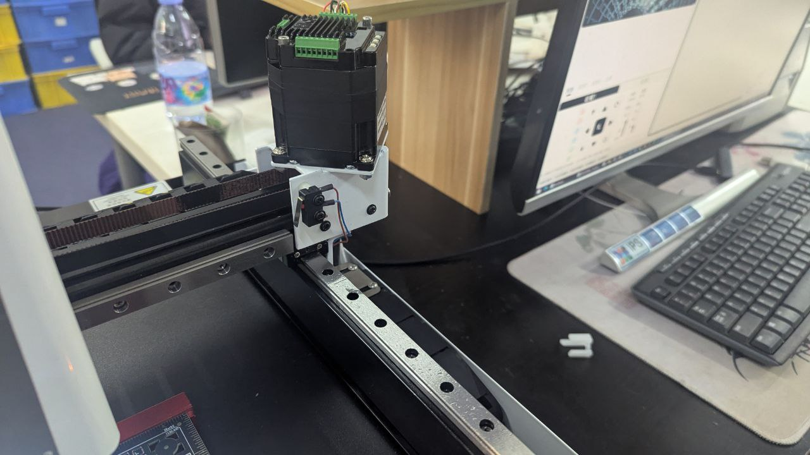
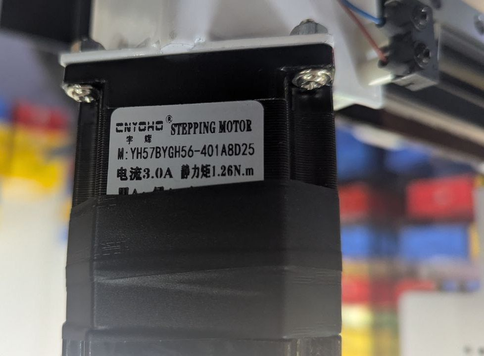

# motor-dat

## motor specs 

- [[torque-dat]]

## motor type 

- [[dc-motor-dat]] == Permanent Magnet Brushed DC Motor

- [[reduction-gear-motor-dat]]

- [[vibrator-dat]]

- [[stepper-dat]] - [[servo-dat]]

- [[Drum-brake-motor-dat]]

- [[coreless-motor-dat]] - [[BLDC-motor-dat]]

## coreless Motor vs. Brushless Motor

## ⚙️ Coreless Motor vs. Brushless Motor

| Feature             | Coreless Motor (Coreless DC Motor)             | Brushless Motor (BLDC)                          |
|---------------------|------------------------------------------------|-------------------------------------------------|
| **Rotor Design**    | No iron core (hollow cup winding)              | Rotor has permanent magnets                     |
| **Commutation**     | **Brushed** (mechanical commutator with brushes) | **Electronic** (uses sensors or controller)   |
| **Inertia**         | Very **low**, allowing fast response           | Moderate, depending on design                   |
| **Efficiency**      | High (especially in low-power apps)            | Very high (especially at medium/high power)     |
| **Noise**           | Very **quiet** at low speed                    | Quiet, can produce high-frequency noise         |
| **Speed Response**  | Extremely **fast** acceleration/deceleration   | Fast, depends on controller and load            |
| **Lifespan**        | Limited (due to brush wear)                    | Long (no brushes = less wear)                   |
| **Maintenance**     | May need brush replacement                     | Minimal maintenance                             |
| **Control Complexity** | Simple (direct voltage control)            | Requires motor controller (ESC)                 |
| **Size / Weight**   | Very compact and lightweight                   | Can be compact but larger for same power        |
| **Typical Voltage** | Low (e.g. 3V, 6V, 12V)                          | Can handle higher voltages (12V–60V+)           |
| **Cost**            | Generally cheaper                              | More expensive due to controller and design     |
| **Best For**        | Micro motors, medical devices, toys, robotics  | Drones, RC vehicles, electric tools, e-bikes    |

## commerlized motor system demo 

## ref 

- [[acturator-dat]]