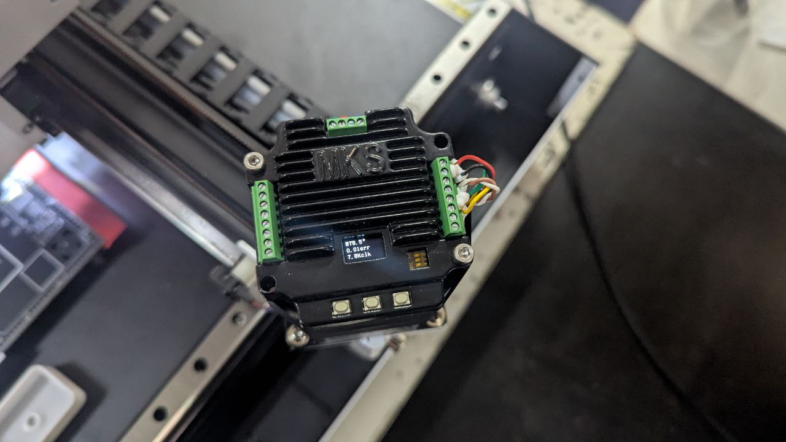

# motor-dat

- [[motor-driver-dat]]

## motor specs 

- [[torque-dat]] - [[start-capacitor-dat]]

## motor type 

brushed

- [[dc-motor-dat]] == Permanent Magnet Brushed DC Motor

- [[DC-gear-motor-dat]] - [[TT-motor-dat]] - [[MG540-dat]] - [[MG513-dat]]

- [[coreless-motor-dat]] 
  
brushless

- [[BLDC-motor-dat]]

- [[stepper-dat]] - [[servo-dat]]

- [[motor-Drum-brake-dat]]

- [[vibrator-dat]]

- [[FPV-motor-dat]]

- [[motor-linear-dat]]

| Type                           | Brushed / Brushless | Key Traits                                     | Application                              |
| ------------------------------ | ------------------- | ---------------------------------------------- | ---------------------------------------- |
| **Coreless DC motors**         | Brushed             | Very lightweight, fast acceleration            | Drones, medical tools, high-end RC       |
| **DC gear motors**             | Brushed             | Built-in gearbox for torque                    | Robotics, automation, lifting mechanisms |
| **Brushless DC motors (BLDC)** | Brushless           | Efficient, no brushes, often sensorless        | E-bikes, drones, industrial fans         |
| **Stepper motors**             | Brushless           | Precise, incremental rotation (not continuous) | 3D printers, CNC, camera sliders         |
| **Servo motors**               | Brushed / Brushless | DC motor + feedback + control board            | RC, robotics, automation                 |
| **Industrial DC motors**       | Brushed             | High voltage/power, long-duty cycles           | Conveyor belts, mills, elevators         |

## 🧱 Common Types

| Motor Type       | Gearbox Type     | Used For                     |
| ---------------- | ---------------- | ---------------------------- |
| Brushed DC motor | Planetary / Spur | Robotics, automation, wheels |
| Coreless motor   | Micro spur gear  | Micro robots, drones         |
| Stepper motor    | Harmonic / Worm  | Precision gear movement      |

## coreless Motor vs. Brushless Motor

## ⚙️ Coreless Motor vs. Brushless Motor

| Feature                | Coreless Motor (Coreless DC Motor)               | Brushless Motor (BLDC)                       |
| ---------------------- | ------------------------------------------------ | -------------------------------------------- |
| **Rotor Design**       | No iron core (hollow cup winding)                | Rotor has permanent magnets                  |
| **Commutation**        | **Brushed** (mechanical commutator with brushes) | **Electronic** (uses sensors or controller)  |
| **Inertia**            | Very **low**, allowing fast response             | Moderate, depending on design                |
| **Efficiency**         | High (especially in low-power apps)              | Very high (especially at medium/high power)  |
| **Noise**              | Very **quiet** at low speed                      | Quiet, can produce high-frequency noise      |
| **Speed Response**     | Extremely **fast** acceleration/deceleration     | Fast, depends on controller and load         |
| **Lifespan**           | Limited (due to brush wear)                      | Long (no brushes = less wear)                |
| **Maintenance**        | May need brush replacement                       | Minimal maintenance                          |
| **Control Complexity** | Simple (direct voltage control)                  | Requires motor controller (ESC)              |
| **Size / Weight**      | Very compact and lightweight                     | Can be compact but larger for same power     |
| **Typical Voltage**    | Low (e.g. 3V, 6V, 12V)                           | Can handle higher voltages (12V–60V+)        |
| **Cost**               | Generally cheaper                                | More expensive due to controller and design  |
| **Best For**           | Micro motors, medical devices, toys, robotics    | Drones, RC vehicles, electric tools, e-bikes |

## commerlized motor system demo 

## mechanical parts 

- [[shaft-coupler-dat]]

## Using Lower KV Motors on Mobula8

### 1. What KV Means
- KV = Motor RPM per volt (without load)
- Higher KV → faster motor spin → more aggressive flight
- Lower KV → slower spin → smoother, more controllable flight

---

### 2. Advantages of Lower KV Motors
- **Smoother indoor flight:** Slower response makes hovering and gentle maneuvers easier
- **Less vibration:** Easier to tune PID for stable flight
- **Lower heat & power draw:** Motors and ESCs run cooler, extending life
- **Longer flight time:** Less energy wasted on high-speed spinning

---

### 3. Disadvantages / Considerations
- **Less thrust:** Mobula8 might struggle with fast flips or aggressive maneuvers
- **Battery voltage match:** Lower KV may require slightly higher voltage (2S→3S) to maintain comparable thrust
- **Propeller size & pitch:** Lower KV works better with slightly larger or higher-pitch props, but Mobula8 frame limits size

---

### 4. Practical Notes
- Stock Mobula8 motors: **EX1103 KV11000**
- Lower KV options: **KV9000–KV10000** for smoother indoor flight
- ESCs must handle motor current; check your 4A–5A rating is sufficient

---

### 5. Summary
- ✅ **Indoor/cinematic flying:** Lower KV preferred
- ⚠️ **Freestyle/acro flying:** Might reduce agility
- Adjust **PID and throttle curves** in Betaflight after motor swap

## ref 

- [[acturator-dat]]