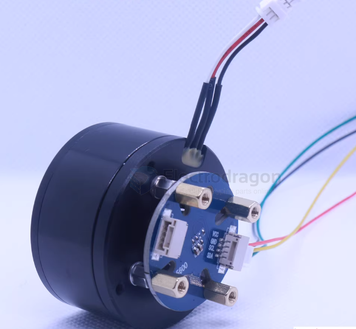
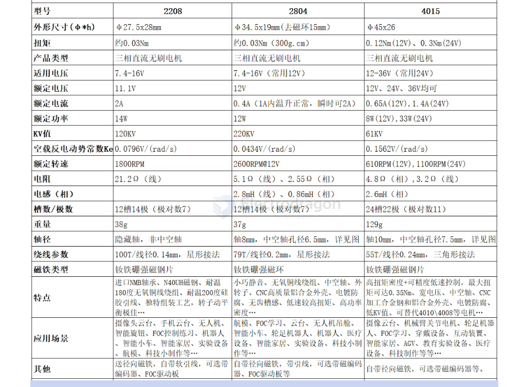

# motor-gimbal-dat

- [[robot-dat]]

- [[encoder-dat]]

- [[motor]]

## info 

Gimbal motors are a specialized type of **Brushless DC (BLDC) motor** designed for high-precision positioning rather than high-speed rotation. They are optimized to keep a camera or sensor perfectly level by making micro-adjustments in real-time.

---

### Main Features

* **High Pole Count:** Unlike standard drone motors, gimbal motors typically have **14 to 22+ magnetic poles**. This allows for extremely smooth, high-resolution movement without the "stepping" sensation found in lower-pole motors.
* **Low Cogging Torque:** They are engineered to minimize the magnetic "bumps" felt when rotating the motor. This ensures that the motor doesn't "snap" into a specific position, allowing for fluid transitions.
* **High Torque at Low RPM:** These motors are designed to hold a specific position or move very slowly with high resistance to external forces (like wind or movement), rather than spinning at thousands of RPMs.
* **Hollow Shaft Design:** A signature physical feature. The center of the motor is often hollow to allow **power and signal cables** (like HDMI or IMU wires) to pass through without tangling during 360-degree rotations.
* **Fine-Gauge Windings:** They use very thin copper wire with a high number of turns. This creates higher internal resistance, which is necessary for the delicate current control required by a gimbal controller.

## types 

## 4015

- Brushless DC motor 4015: low-speed, high-torque design. Peak torque up to ~0.35 Nm. Well suited for wheeled/leg robots, robot joints, camera gimbals and similar applications.
- Mechanical compatibility: can replace 4010 / 4008 motors — same outer diameter; stator is 5 mm taller than 4010 for increased torque.
- Supports FOC control. Rotor uses NdFeB magnetic segments for strong magnetic flux.
- 3D CAD files available for easy integration and modeling.
- Compatible with FOC driver stacks and libraries such as SimpleFOC, DengFOC, ODrive (with MT6701 encoder option) and VESC (motor only). Example code and integration notes provided.
- Encoder options: AS5600 (I2C, 12-bit) or MT6701 (ABZ, 14-bit). Both share the same mounting holes — choose based on your preferred interface.

Specifications (typical / nominal)

| Item | Value |
|---|---:|
| Model | 4015 |
| Slots / Poles | 24 slots, 22 poles (11 pole pairs) |
| Motor outer diameter | 45 mm |
| Motor height | 24 mm |
| Stator diameter | 40 mm |
| Stator height | 15 mm |
| Shaft diameter | 10 mm |
| Hollow shaft bore | 7.5 mm |
| Weight | 129 g |
| Recommended supply voltage | 12 – 36 V |

Electrical / performance (measured / typical)

| Condition | Rated torque | Max torque | Rated speed | Rated current | Max current | Rated power |
|---|---:|---:|---:|---:|---:|---:|
| 12 V (typical) | 1200 g·cm (0.12 Nm) | 1500 g·cm (0.15 Nm) | 610 RPM | 0.65 A | 4 A | — |
| 24 V (typical) | 3000 g·cm (0.30 Nm) | 3500 g·cm (0.35 Nm) | 1100 RPM | 1.4 A | 4 A (typ) | 33 W |

Motor constants and electrical data

| Parameter | Value |
|---|---:|
| Speed constant (Kv) | ~61 RPM/V |
| Back-EMF constant (Ke) | 0.1562 V/(rad/s) |
| Phase resistance (per phase) | 4.80 Ω |
| Phase inductance (per phase) | 2.6 mH |
| Magnet type | NdFeB magnetic segments |
| Winding turns | 55 turns (per phase) |
| Wire diameter | 0.24 mm |
| Winding connection | Delta (triangle) connection |

Notes

- Values above are taken from manufacturer/test data and may vary by unit and measurement method. Use conservative margins for current/thermal design.
- Choose encoder (AS5600 or MT6701) depending on control method (I2C vs incremental ABZ). Both mount to the same footprint.

## GM4108H-120T Gimbal Motor

- Model: GM4108H
- Motor Out Diameter: Ф47±0.05mm
- Configuration: 24N/22P
- Motor Height: 32.3±0.2mm
- Hollow Shaft(OD): Ф10-0.008/-0.012mm
- Hollow Shaft(ID): 8+0.05/0mm
- Wire Length: 265±3mm
- Cable AWG: #24
- Motor Weight: 124±0.5g
- Wire plug: 2.5mm dupont connector
- No-load current: 0.07±0.1A
- No-load volts: 20V
- No-load Rpm: 513~567 RPM
- Load current: `1.5A`
- Load volts: `20V`
- Load torque(g·cm): 1200-1800 == $1200\text{--}1800$ $g\cdot cm$ becomes $1.2\text{--}1.8$ $kg\cdot cm$. 

- [[torque-dat]]

- Motor internal resistance: 11.1Ω±5%（Resistance varies with temperature）
- High voltage test: DC500V 1mA@2sec
- Rotor housing runout: ≤0.1mm
- Steering (axle extension): Clockwise
- High-low temperature test：
- High temperature: Keep at 60℃ for 100 hours, and the motor can work normally after 24 hours at room temperature
- Low temperature：Keep at -20℃ for 100 hours, and the motor can work normally after 24 hours at room temperature
- Maximum power: ≤25W
- Working current: 3-5S
- Working temperature: -20~60℃;10~90%RH

## CN 

