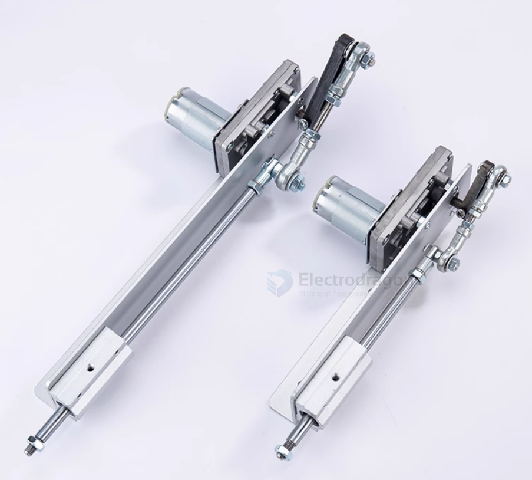

# motor-linear-dat

linear motor is a type of electric motor that produces linear motion instead of rotational motion. It is commonly used in applications where precise linear movement is required, such as in robotics, automation, and CNC machines.

## ref 

- [[motor-dat]]