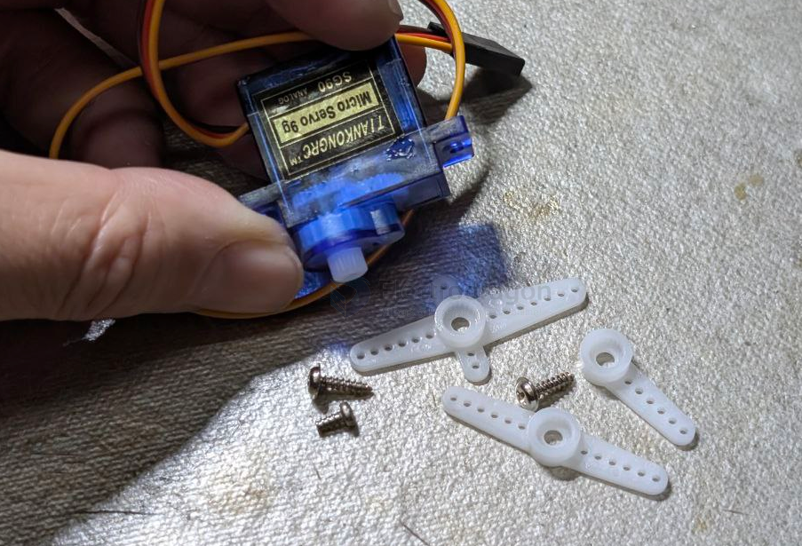
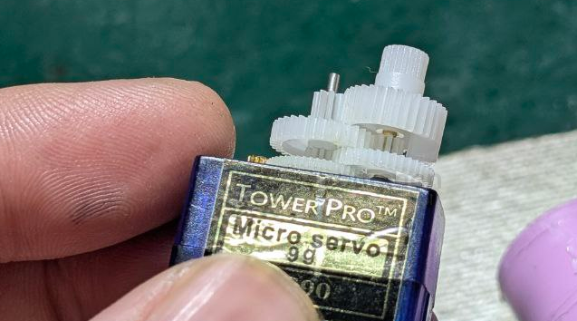
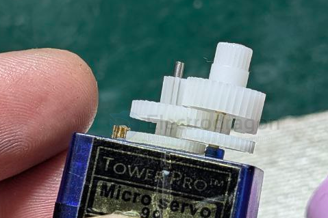
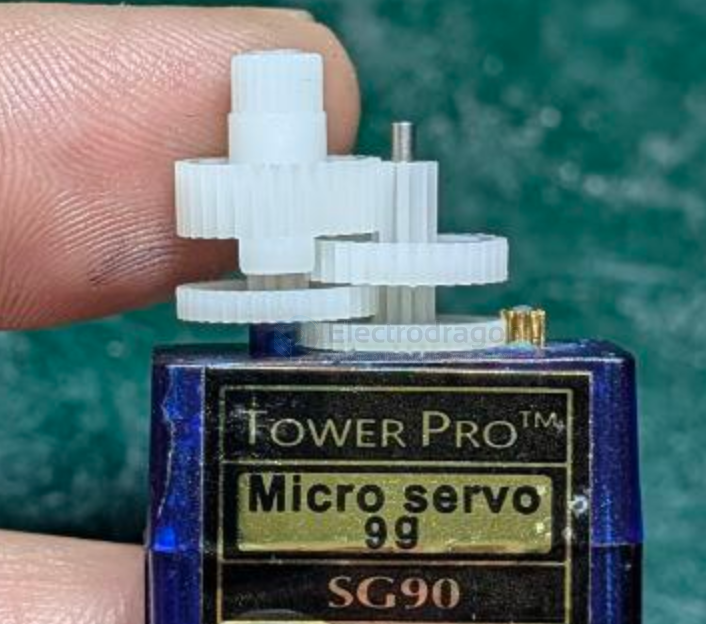

# SG90-dat

- [[SCU1030-dat]] - [[SG90-dat]]

- [[servo-horn-dat]] - [[motor-servo-dat]]

screw == M2 x 7.5 

## internal gearbox 

- [[gear-dat]] - [[gearbox-dat]] - [[SG90-dat]]

## more variations 

| model             | degree | gear materials | limit    | stall current | stall torque  |
| ----------------- | ------ | -------------- | -------- | ------------- | ------------- |
| SG - 90 -         | 180    |                |          |               | 1.3 kgcm?     |
| SG - 92 - R       | 180    |                |          |               | 1.3-1.6 kgcm? |
| SG - 92 - R       | 180    |                | included |               | 1.3-1.6 kgcm? |
| TS - 90 - A       | 180    |                |          | 800 ma        | 2.2 kgcm?     |
| TS - 90 - D       | 180    |                |          | 800 ma        | 2.2 kgcm?     |
| MG - 90 - S - PA  | 180    | plastic+ALU    |          | 860 mA        | 2.0 kgcm?     |
| MG - 90 - D - PD  | 180    | plastic+ALU    |          | 860 mA        | 2.0 kgcm?     |
| MG - 90 - S - A   | 180    | ALU            |          | 860 mA        | 2.0 kgcm?     |
| MG - 90 - D - A   | 180    | ALU            |          | 860 mA        | 2.0 kgcm?     |
| MG - 90 - S - A   | 180    | ALU            | included | 860 mA        | 2.0 kgcm?     |
| MG - 90 - D - A   | 180    | ALU            | included | 860 mA        | 2.0 kgcm?     |
| TS - 90 - M - CA  | 180    | copper+ALU     | included | 800 ma        | 2.2 kgcm?     |
| TS - 90 - MD - CA | 180    | copper+ALU     | included | 800 ma        | 2.2 kgcm?     |

### TS90 

- TS90A motor gears are made of metal, ensuring smooth rotation and preventing deformation under heat.
- TS90A potentiometer gear shafts are also made of metal, resisting deformation under stress.
- TS90A gears have stop points for limiting movement.

## demo 

[fake and genius vendors' different specs on move](https://t.me/electrodragon3/441)

## ref 

