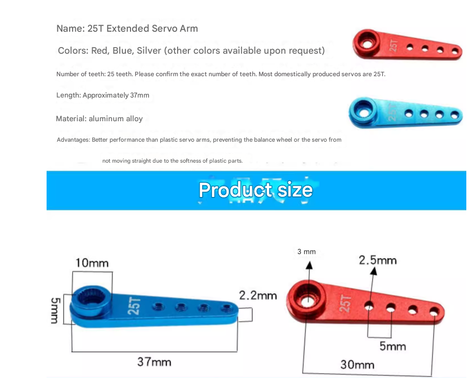

# servo-horn-dat

- [[servo-connector-dat]] - [[servo-horn-dat]]

## servo horn types 

## info 

In the context of servo motors and robotics, the connector that attaches to the output shaft is most commonly called a Servo Horn.

Depending on the specific part of the linkage you are referring to, here are the standard English terms used in mechanical design and RC hobbyism:

1. The Main Connector (Attaches to the Shaft)

Servo Horn: The most common term. These come in various shapes:

- Single Arm: A straight lever extending in one direction.
- Double Arm: A straight lever extending in two opposite directions.
- Cross / Four-way: Shaped like a "+" for multiple attachment points.
- Circular / Round Horn: A disc shape, often used for mounting larger gears or pulleys.

Servo Arm: Often used interchangeably with "horn," typically referring to the lever-style connectors.

2. The Linkage Components (Connecting the Horn to the Load)
If you are looking for the parts that connect the servo horn to the rest of your Rover V2 chassis, you likely need these:

- Linkage Rod / Pushrod: The metal or plastic rod that transmits the motion.
- Ball Link: A joint that allows for multi-angle rotation, very common in steering assemblies to prevent binding.
- Clevis: A U-shaped fastener that clips onto the holes of the servo horn.
- Turnbuckle: A threaded rod that allows you to adjust the length of the linkage without disconnecting it.

3. Technical Terms for CAD and Sourcing

If you are searching for parts or designing a custom 3D-printed attachment, use these technical keywords:

- Spline: The "teeth" on the servo output shaft. You must match the spline count (e.g., 25T for standard Futaba/MG996R servos or 21T/23T for others).
- Spline Adapter: A component that converts the servo spline into a different mounting interface (like a D-shaft or a hex mount).
- Servo Hub: A heavy-duty aluminum connector, usually circular, used for high-torque applications.

## ref 

