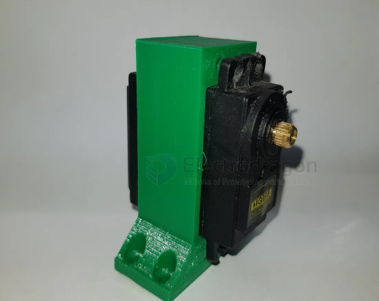
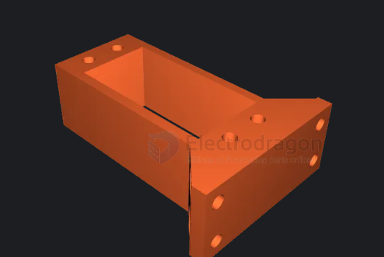
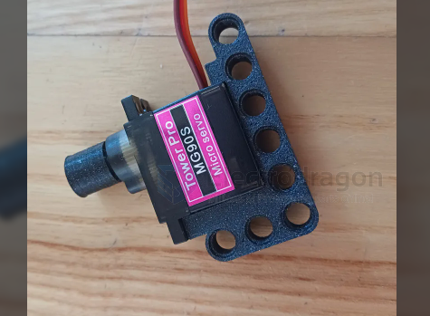
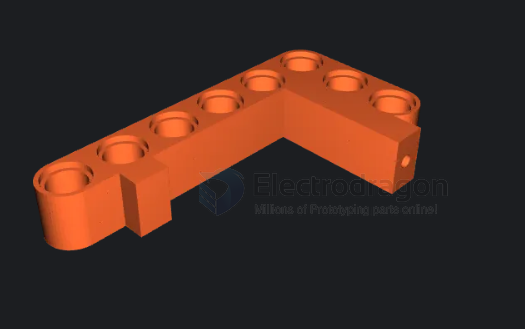
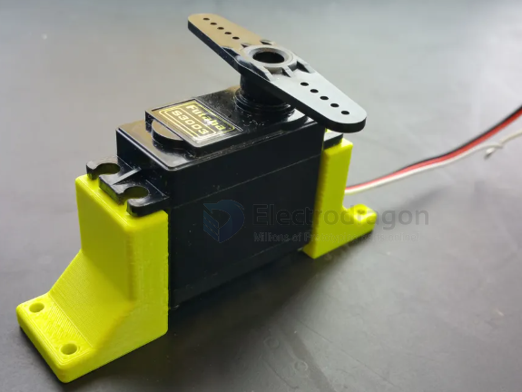
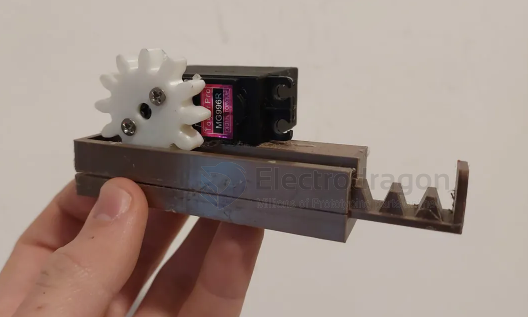
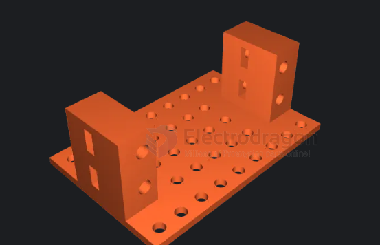
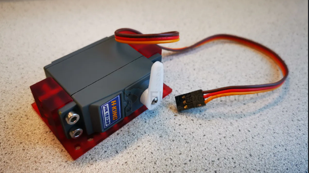

# servo-mount-dat

## builds

build 5 - vertical 

https://www.printables.com/model/381611-servo-holder-mg995

build 4 - lego 

https://www.printables.com/model/602773-micro-servo-lego-compatible-mount

build 3 - 

https://www.printables.com/model/254115-simple-servo-mount

build 2 - linear 

https://www.printables.com/model/730367-rack-and-pinion-linear-servo-actuator

build 1 - flat mount 

https://www.printables.com/model/460940-standard-servo-mount-flat

## ref 

