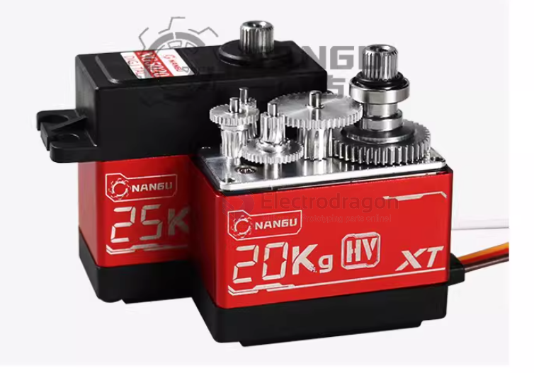
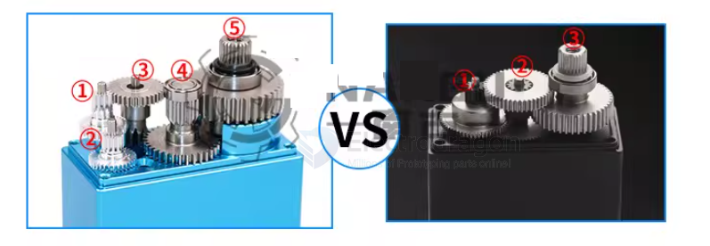

# servo-rank-dat

| model                  | torque KG/CM           | LRC                  | note    | order           |
| ---------------------- | ---------------------- | -------------------- | ------- | --------------- |
| RDS5180 80KG           | 80KG~105KG @ 8.4V      | 6.5A                 |         |                 |
| RDS5160 60KG           | 60~70KG @ 8.4V         | 6.5A                 |         |                 |
| RDS3115 15KG           | 15~17 @ 8.4V           | 2.5A                 |
| XINHUI                 | 60 / 45 / 35 / 25 / 20 | 6.2A / 1.25A / 1.13A | unit ?? |                 |
| XINHUI high-speed      | 25 / 10                |                      | unit ?? |                 |
| NANGU                  | 35 @ 8.4V              | 0.65A                |         |                 |
| MG996R                 | 9~15                   |                      |         | [[SCU1012-DAT]] |
| MG995 / MG946R / MG945 | 9~13                   |                      |         | [[SCU1012-DAT]] |
| PTK 7465 7465W         | 5.8 @ 8.4V             |                      |         |                 |
| SG92R                  | 2.5                    |                      | 9g      |                 |
| EMAX ES08MA            | 1.8 @ 6V               |                      | 9g     |                 |
| SG90                   | 1.6                    |                      |         | [[SCU1030-DAT]] |
| MG90S / MG90           | 2.0                    |                      |         | [[SCU1031-dat]] |
| PTK 7350MG-D 5.5g      |

- [[current-dat]]

## nangu 

steel gears, gears number == x4 or x5

## ref 

- [[servo-dat]] - [[servo]]

- [[robot]]