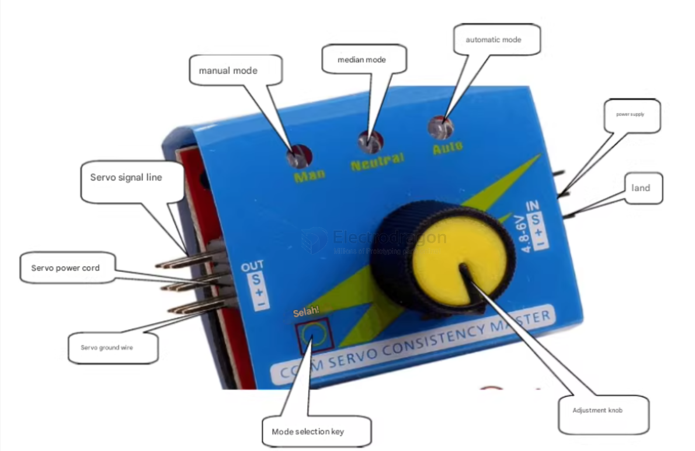

# servo-tuner-dat

2.特点：
（1）能够很方便的检测和设定伺服器的虚位，抖动和中位。
（2）可连接三组舵机或电调，单片机控制好，稳定性好，精度高。旋转旋钮即可检测舵机。
（3）如果连接电子调速器（有刷和无刷均可），即可摆脱遥控设备进行手动调速，用于检测调速器和马达的性能非常实用，不用再繁琐地连接遥控器和接收机了。它相当于一个手动调节机的功能，通过旋钮模拟发射机打舵。

3.使用方法：
（1）如图所示，基本将舵机测试仪上面的引脚，控制及指示部分标出，其中S标志符对应的引脚在这里没有什么用，可以不用理会。左边接舵机可分为上中下3 组，即可同时测试3个舵机。

（2）从右边单排插针接上电源，三个蓝色灯会同时亮一下，然后最左边的灯会亮，此时就可以通过模式选择按键去选择三种模式，

当最左边的灯亮时，为手动调节模式，可直接用电位器（及调节旋钮）去控制舵机的旋转；

然后按下按键，中间灯会亮，此时为归中测试；

再按一下按键，最右边的灯会亮，为自动测试，舵机会不停的旋转，卡死后再反向旋转，依次循环。测试电调的接法与舵机的一样，测试马达时需先接电调，方法均是按上面的步骤。