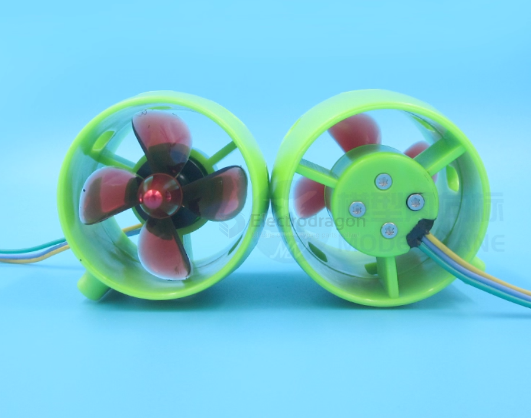

# motor-waterproof-dat

## 1. Use a Motor Housing (External Enclosure)
You place the motor *outside the water* by sealing it in a waterproof enclosure.

- [[waterproof-container-dat]]

### Requirements:
- A sealed plastic/metal container (PVC tube, acrylic box, aluminum canister)
- Rubber O-rings
- Waterproof cable gland

### Why this is best:
- The motor stays dry.  
- Very reliable and safe.  
- Easy to repair.

---

## 2. Waterproof the Output Shaft Area
This is the part where water enters the fastest.

### Methods:
- **Double Rubber Shaft Seals** (radial shaft seals)
- **Grease-filled Bearing Chamber**  
  Grease blocks small leaks and lubricates the shaft.
- **Ceramic or Stainless Shaft Sleeve**  
  Reduces rust and seal wear.

---

## 3. Coat the Motor Internals (Not Recommended for Beginners)
Some hobbyists use:
- Epoxy resin coating  
- Waterproof varnish (for coils)

But this has limits:
- Hard to do evenly  
- Heat dissipation becomes worse  
- Bearings still rust unless replaced with stainless ones

---

## 4. Use Oil-Filled Motor Housing
Some underwater ROVs fill the motor compartment with **mineral oil** to equalize pressure.

Advantages:
- No water ingress  
- Better cooling  
- Works at greater depth

Disadvantages:
- You need a sealed box  
- Oil leaking is messy  
- Not suitable for small toy motors unless well designed

---

## 5. Replace Bearings + Hardware
To avoid corrosion:
- Use **stainless steel** bearings  
- Use **stainless screws**  
- Avoid carbon steel

---

# Summary: Best Practical Method
The **best and safest** way is:

> Put the motor inside a waterproof container + use a sealed output shaft.

This is the same method used by:
- Underwater drones  
- Bilge pumps  
- Pool robots

## ref 

- [[motor-dat]] - [[waterproof-dat]] - [[motor-waterproof-dat]]