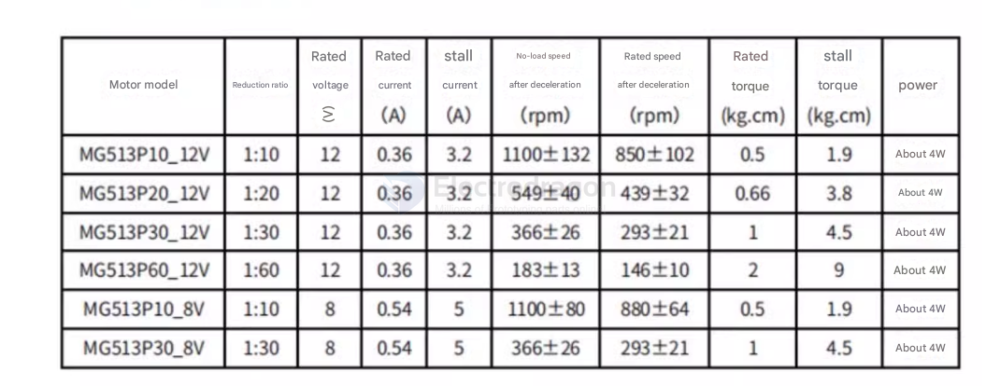
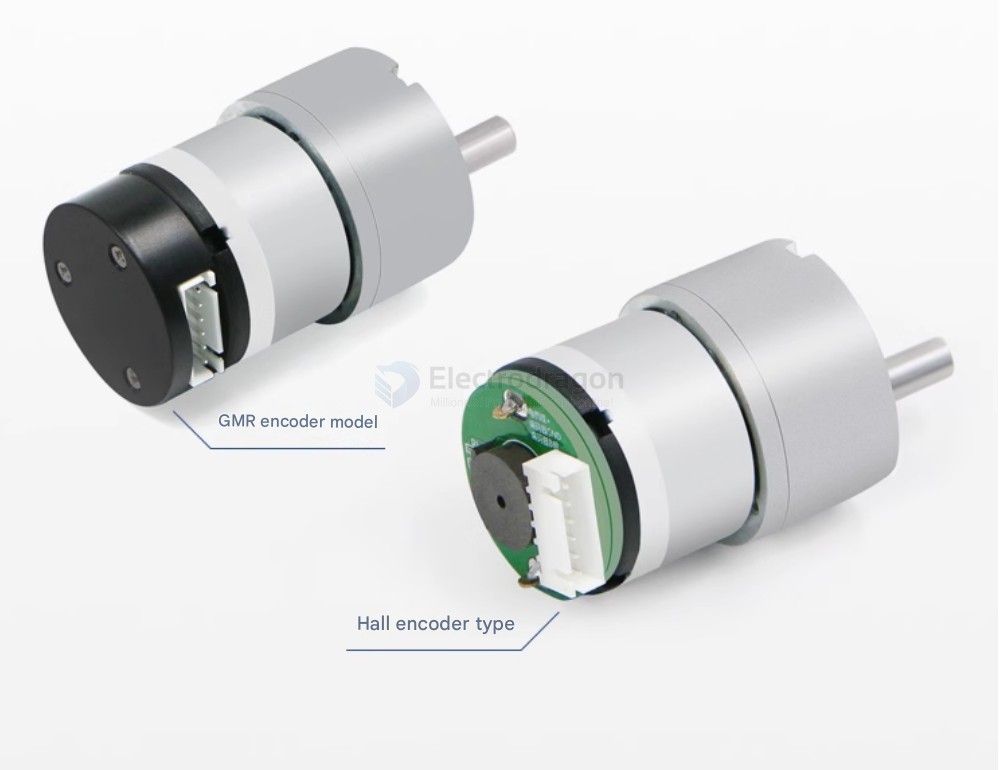

# MG513-dat

## MG513 Motor Overview

The **MG513** is a **DC 12V reduction gear motor** equipped with an **encoder**, commonly used in applications requiring precise speed and position control, such as self-balancing robots and inverted pendulum systems.

---

### **Key Features**
- **Voltage:** Operates at **12V DC**.
- **Gear Reduction:** Features an internal gear reduction mechanism, providing lower output speeds and higher torque.
- **Encoder Integration:** Equipped with an encoder for accurate speed and position feedback, essential for closed-loop control systems.
- **Applications:** Ideal for DIY projects like **self-balancing cars** and **inverted pendulum robots**.

---

### **Typical Applications**
- **Robotics:** Used in **tracked robots** and **autonomous vehicles**.
- **Self-Balancing Systems:** Suitable for projects like **inverted pendulum robots**.
- **Automation:** Can be used in precision motorized platforms.

---

### **Conclusion**
The **MG513 motor** is a great choice for robotics and automation projects that require **high torque, speed control, and accurate position feedback**. 

For detailed specifications like **RPM, torque, and current draw**, refer to the **manufacturer’s datasheet** or contact the supplier.

## specs 

Internal parameters of the motor
- Inductance: 4.45mH
- Back electromotive force coefficient (Ke): 0.00103V/rpm
- Armature resistance: 2.3Q ± 0.5
- Electromagnetic torque coefficient (KT): 0.00984Nm/A

Note: Ke and Kt are the parameters of the motor itself (without reduction gearbox). When using, they need to be multiplied by the corresponding reduction ratio of the motor.

## products images 
