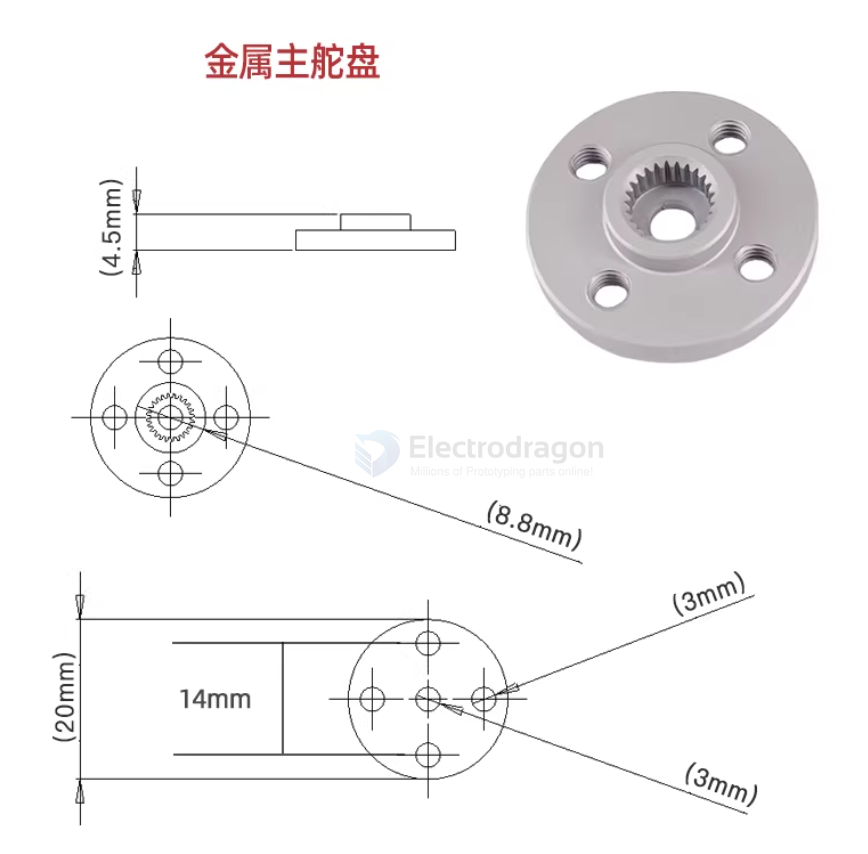
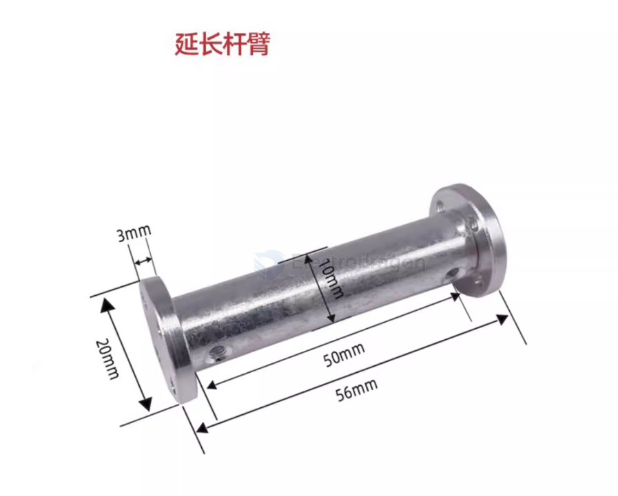

# servo-connector-dat

normal servo output tooth == 25T 

also in - [[SCU1012-dat]]

- red == rubber [[spacer-dat]]
- green == [[rivet-dat]]

## main flange 

## ref 

- [[servo-dat]]

- [[servo-connector]] - [[servo]]