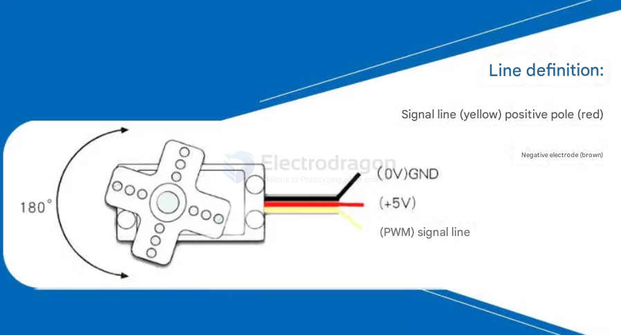
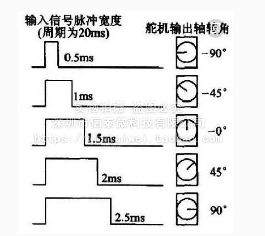
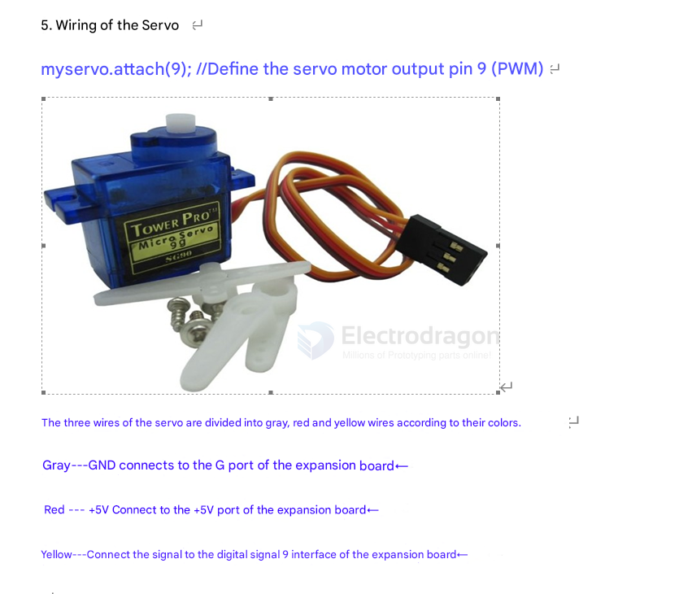

# servo-dat

- [[servo-gimbal-dat]]

- [[peripherals-dat]]

- [[PWM-dat]]

- [[servo-connector-dat]]

- [[servo-HDK-dat]] - [[servo-SDK-dat]]

- [[servo-360-dat]]

- [[PCA9685-dat]]

## tech 

- [[servo-DSC-dat]]

## products 

- Micro servo - [[SCU1030-DAT]] - [[SCU1031-dat]] == SG90 / MG90

- MG995 / MG996R micro servo - [[SCU1012-DAT]] == 13KG 

These servo models differ primarily in terms of gear material, torque, and rotation angle. 

The SG90 is the basic widely-used model. The SG90 comes in 90-degree, 180-degree, and 360-degree versions that are identical except for their rotation angles. 

The MG90S is essentially an enhanced version of the SG90 with metal gears, though its mounting dimensions differ slightly from the SG90.

The 90-degree and 180-degree servos have identical physical dimensions and torque specifications, differing only in their maximum rotation angles. The 360-degree servo allows continuous rotation.

The fixed-wing S-version servo (with 25cm wire length) is not the helicopter version. Compared to helicopter servos, it has lower pull strength, performance, and motor lifespan. It's suitable for electric fixed-wing aircraft made of foamboard or foam (recommended) and offers good value for money.

## feature of servos 

- The servo is a device that can control the angle of rotation of the motor shaft. It consists of a DC motor, a gear set, and a position feedback system.
- The servo can be controlled by a PWM signal, which determines the angle of rotation of the motor shaft.
- The servo can be used in various applications, such as robotics, RC vehicles, and automation systems.
- The servo can be classified into different types based on its construction and operation, such as analog servos, digital servos, and continuous rotation servos.
- The servo can be powered by different voltage levels, typically ranging from 4.8V to 6V for standard servos and up to 7.4V for high-performance servos.
- The servo can be controlled by different protocols, such as PWM, I2C, and UART, depending on the application and the controller used.
- The servo can be equipped with different types of gears, such as plastic gears, metal gears, and ceramic gears, depending on the torque and speed requirements of the application.
- The servo can be used in various configurations, such as standard servos, mini servos, micro servos, and high-torque servos, depending on the size and weight constraints of the application.
- The servo can be used in different environments, such as indoor, outdoor, and underwater, depending on the sealing and protection features of the servo.
- The servo can be used in different applications, such as robotics, automation, and control systems, depending on the requirements of the application.
- The servo can be used in different industries, such as automotive, aerospace, and consumer electronics, depending on the requirements of the application.

## test note

- user a [[servo-tester]] to get the range of the servo first 

- test without a load first 

- the internal [[gearbox-dat]] can be burned if too high load used 

## wiring 

## Knowledge

The control of the steering gear generally requires a time base pulse of about 20ms. The high level part of the pulse is generally the angle control pulse part in the range of 0.5ms-2.5ms, and the total interval is 2ms.

Taking the 180-degree angle servo as an example, the corresponding control relationship is as follows:

| Pulse (ms) | Pulse (µs) |  Angle (°) |
| ---------: | ---------: | ---------: |
|     0.5 ms |     500 µs |          0 |
|     1.0 ms |    1000 µs |         45 |
|     1.5 ms |    1500 µs |         90 |
|     2.0 ms |    2000 µs |        135 |
|     2.5 ms |    2500 µs | 180 or -90 |

## code 

### arduino 

## servo calibration 

## Mechanical Calibration

1. Power the servo and send 1500 µs signal (center pulse).
2. Remove the servo horn (the arm).
3. Reattach the horn so it points exactly to the middle.

✅ Best method — keeps full 0–180° movement range.

## FIND A SERVO'S PHYSICAL MIDDLE WITHOUT POWERING IT

### METHOD 1: Gentle Manual Rotation

1. Hold the servo body firmly in one hand.
2. Gently rotate the output shaft with your fingers.

⚠️ IMPORTANT RULES:
- SG90 and most servos are geared; never force rotation beyond stops.
- You will feel two hard mechanical limits (one on each side).
- The total range is usually about 180° or a bit less.
- The *middle* is approximately halfway between those two stops.

Example steps:
  a. Turn fully to one end (gently).
  b. Mark that position (e.g., note horn orientation).
  c. Turn fully to the other end.
  d. Move the horn halfway back to the middle of that range.

✅ This gives a close estimate of the neutral angle.

### 📏 METHOD 2: Remove the Horn and Reinstall at Mid

1. Unscrew and remove the servo horn (the plastic arm).
2. Rotate the output spline gently until it’s roughly centered
   (halfway between stops as found above).
3. Reattach the horn pointing straight (e.g., vertical).

💡 When you later power the servo, it should be close to neutral.
Fine-tune by sending 1500 µs and adjusting slightly if needed.

## FAQs 

### Can a Servo Hold Position When Power Is Off?

**No**, standard servos cannot hold position when powered off — they lose holding torque.

#### Alternatives:
- **Servos with mechanical brakes** – lock position without power.
- **High gear ratio digital servos** – may resist movement, but not reliable.
- **Stepper motors with brakes** – hold position more effectively.
- **External locking mechanisms** – physical clamps or brakes.

## mini-servo 

- used for robot joint

## Apps and Extensions 

- [[worm-gear-dat]]

## demo 

https://t.me/electrodragon3/401

## unsort 

Hitec 海泰克 HS-5565MH 高压数字标准舵机 速度快 空心杯电机 G1可编程电路 不防水

## app 

lock and unlock system 

to linear output 

connector to a [[crank-dat]]

## high torque servo 

35KG version 

## code 

- [[code-dat]]

## ref 

- [[motor-dat]]

- [[servo]]