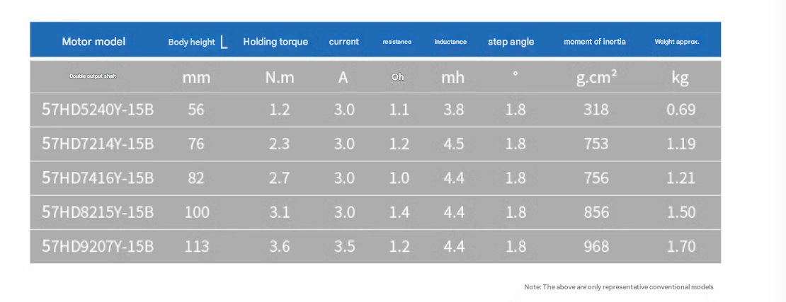

# stepper-dat

- [[stepper-driver-dat]]

## boards 

- [[SCU1024-dat]]

## common options 

- dual shaft 

## common motors specs NEMA 23 

## How to identify the common port of a 4-wire motor: 

Use the resistance * 1 position of the multimeter to measure the four terminals separately. 

If the resistance value of one terminal is the smallest and equal to that of the other three terminals, then this terminal is the COM terminal, which is the common terminal. 

The driver board automatically identifies 3-wire or 4-wire brushless motors,  

4-wire brushless motors can also be connected without COM lines.

## NMEA Series 

- [[NEMA-17-dat]] - [[NEMA-23-dat]]

| NEMA Size | Faceplate Size (mm) | Typical Torque (N·m) | Typical Current (A) | Common Use Cases                            |
|-----------|----------------------|----------------------|----------------------|---------------------------------------------|
| NEMA 6    | 15 x 15              | < 0.01               | 0.2 – 0.5            | Tiny devices, precision instruments         |
| NEMA 8    | 20 x 20              | 0.01 – 0.03          | 0.3 – 0.8            | Compact medical devices, miniature robotics |
| NEMA 11   | 28 x 28              | 0.04 – 0.1           | 0.6 – 1.2            | Small automation, instrumentation           |
| NEMA 14   | 35 x 35              | 0.1 – 0.2            | 0.8 – 1.5            | Light-duty CNC, compact robotics            |
| NEMA 16   | 39 x 39              | 0.15 – 0.25          | 1.0 – 1.8            | Slightly more powerful applications         |
| **NEMA 17**   | 42 x 42              | 0.2 – 0.5            | 1.0 – 2.0            | 3D printers, desktop CNC, hobby electronics |
| **NEMA 23**   | 57 x 57              | 0.6 – 3.0            | 2.0 – 3.5            | CNC machines, automation, robotics          |
| NEMA 24   | 60 x 60              | 2.0 – 4.0            | 2.0 – 4.0            | Industrial applications                     |
| NEMA 34   | 86 x 86              | 4.0 – 12.0           | 3.5 – 6.0            | Heavy-duty CNC, automation systems          |
| NEMA 42   | 110 x 110            | 10 – 20+             | 5.0 – 10.0           | Large industrial machinery                  |

## ref 

- [[stepper]]