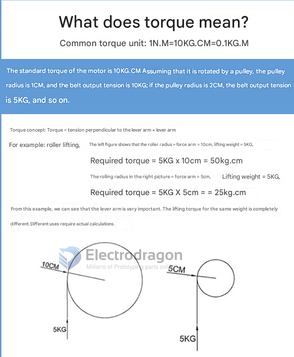
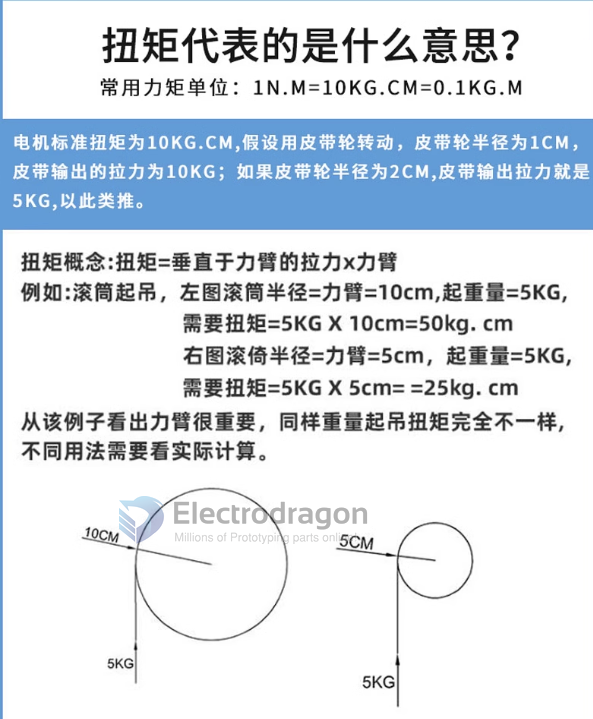

# torque-dat

note the rated torque of a motor is the maximum torque that the motor can deliver at its rated speed.

and stall torque is the maximum torque that the motor can deliver at zero speed.

## what is torque 

## ref 

- [[motor-dat]]