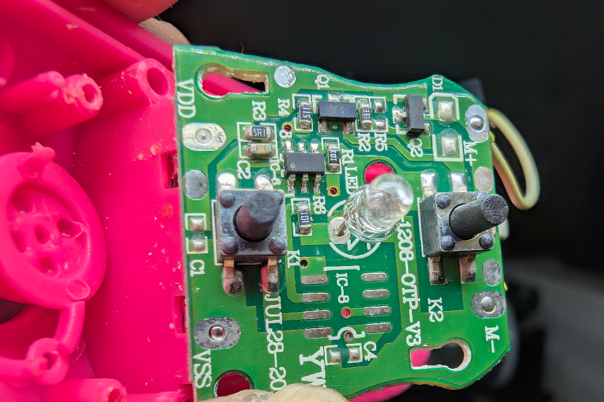
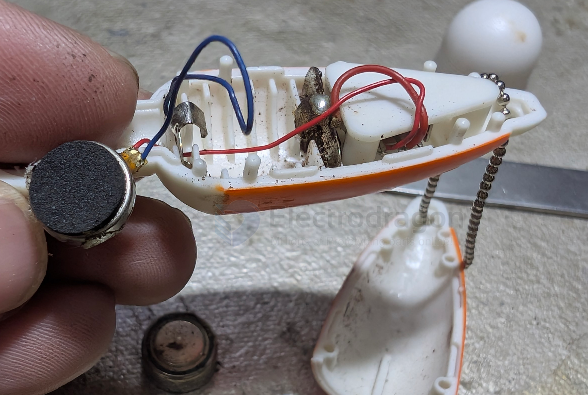
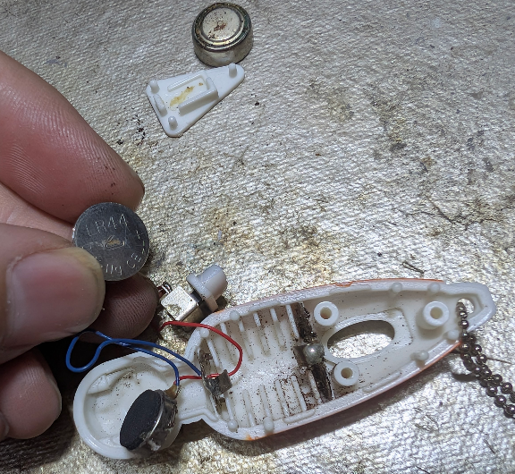
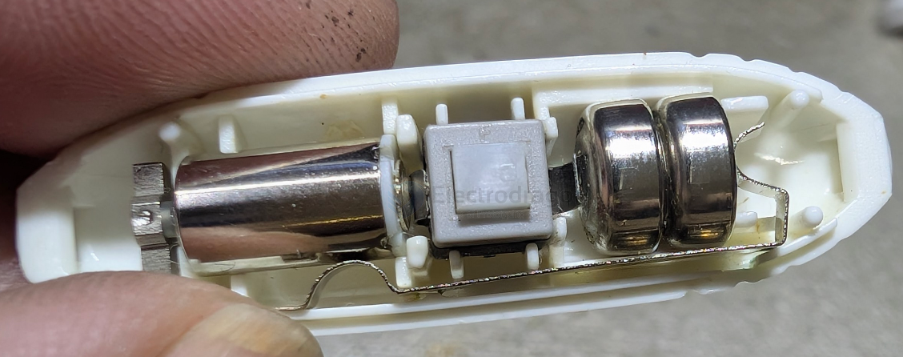

# vibrator-dat

- [[vibrator-dat]] - [[buzzer-dat]] - [[motor-dat]] - [[light-dat]] - [[acturator-dat]] 

- [[SCU1028-dat]] - [[SCU1029-dat]]

## build product 

build 3 - controllerable circuit unknown chip 

build 2 

- [[vibrator-dat]] - [[button-dat]] - [[battery-coin-dat]] - [[LR44-dat]]

un-smart vibrator 

- [[vibrator-dat]] - [[button-dat]] - [[battery-coin-dat]] - [[battery-dat]] - [[LR41H-dat]] x2

- [[vibrator-dat]] - [[fab-sheet-metal-dat]]

## build SCH 

## apps 

- [[smartband-dat]]

