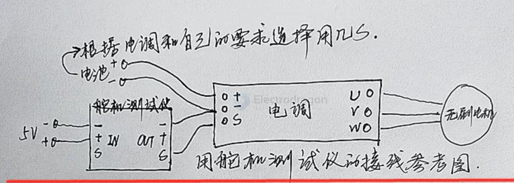
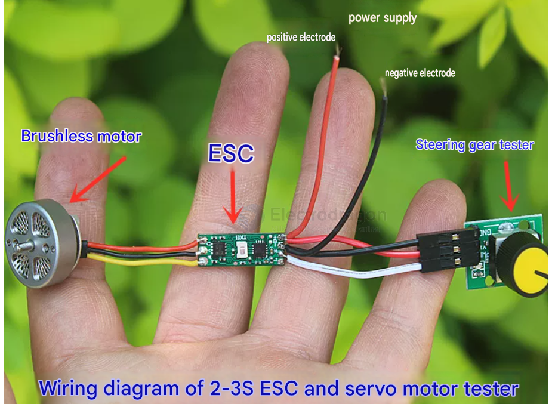
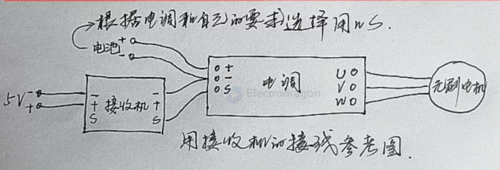
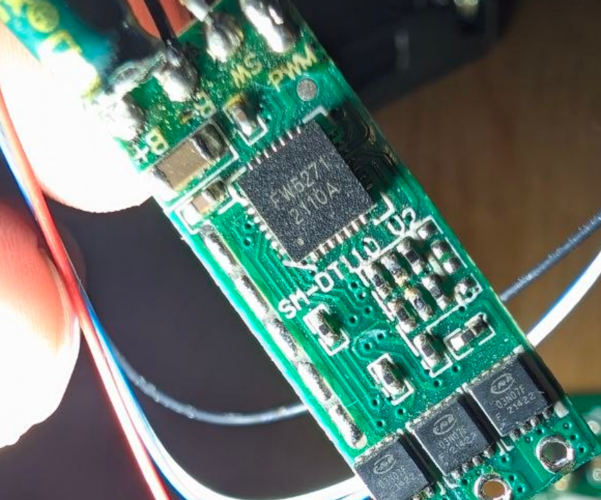
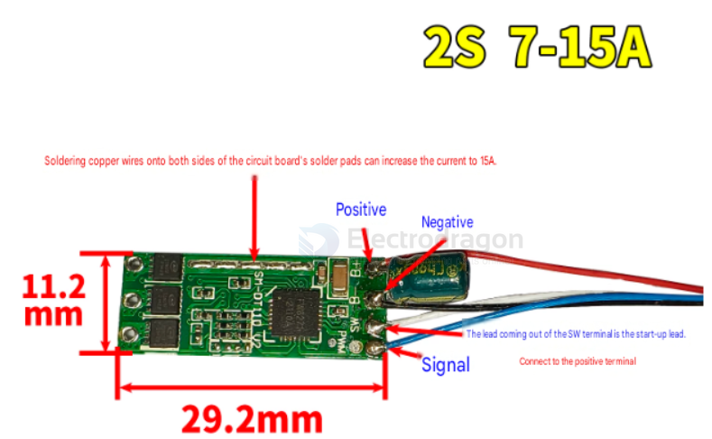

# ESC-dat

- [[ESC-dat]] - [[VESC-dat]] - [[motor-driver-dat]] - [[FOC-dat]]

- [[RC-kits-dat]]

- [[ESC-dat]] - [[power-BEC-dat]]

- [[ESC-dat]] - [[motor-brushless-dat]]

- **Brushed ESC**: Operates using an H-Bridge configuration. It outputs standard 2-wire DC power, adjusting speed simply by turning the DC voltage on and off rapidly via Pulse Width Modulation (PWM).  
- **Brushless ESC**: Operates using a 3-phase inverter circuit. It outputs 3-wire AC power (three-phase), sequentially switching the coils based on back-EMF or sensor feedback to rotate the magnets. 

- **VESC (Open Source ESC)**: The VESC framework natively supports configuring the hardware into brushed DC mode, enabling a heavy-duty brushless controller to drive large brushed motors.
- **AM32 / BlHeli custom firmware**: In combat robotics, builders frequently flash custom firmware onto cheap brushless ESCs to re-map the 3 phases, converting a single brushless ESC into a driver that can independently control one or even two brushed motors.  
- **Novak / Castle Creations RC Car ESCs**: Many legacy and modern high-end surface ESCs feature an auto-detect or programmable mode allowing drivers to save money when transitioning an RC chassis from a brushed setup to brushless.

## test demo wiring CN 

- 有的输入带SW端口是启动线要接电源正极
- 有的带L端口是LED线接负极点亮

## mini ESC board 

fw5271 2110A ?? 

03N07F - [[mosfet-dat]]

## info 

- **Electronic Speed Controller (ESC)**: Controls the speed of the motors by adjusting the power supplied to them. ESCs are essential for smooth and responsive flight.

## Using a Single ESC for a 200W BLDC Motor

A **single ESC** (Electronic Speed Controller) is the standard way to control a 200W BLDC motor. Since you are aiming for high torque and smooth operation, here is how to select and use one professionally:

#### 1. Key Specifications to Match
To prevent the ESC from overheating, you must match the current (Amps) to your power goal:
* **The Math:** $Current (A) = \frac{Power (200W)}{Voltage (V)}$
* **Recommended Buffer:** Always choose an ESC with a current rating **2x higher** than your calculated continuous current to handle torque spikes.

| Battery Voltage | Continuous Amps | Recommended ESC Rating |
| :--- | :--- | :--- |
| **12V** | 16.7 A | **35A - 40A** |
| **24V** | 8.3 A | **20A - 25A** |
| **36V** | 5.5 A | **15A - 20A** |

---

#### 2. Why "Robotics" ESCs are better than "Drone" ESCs
For a project involving an 8mm shaft and gear reduction, **avoid standard Drone ESCs**. They are optimized for high RPM, not low-speed torque.

* **Best Professional Choice:** **VESC (Vedder ESC)**. It is designed for high-torque applications, supports **FOC** (silent and smooth), and is highly programmable.
* **Sensored Control:** If your motor has Hall sensors (5 small wires), use a **Sensored ESC**. This allows the motor to start smoothly under heavy load without "shuddering."

---

#### 3. Connection Setup
A single ESC acts as the "middleman" in your system:
1.  **Input:** Connected to your Battery (XT60 or XT90 connectors).
2.  **Output:** Three thick wires (Phases A, B, C) connected to the motor.
3.  **Control:** A signal wire (PWM/PPM or UART) connected to an Arduino, ESP32, or a remote receiver.

- [[VESC-dat]]

---

### Summary for your 200W Setup:
* **Driver Method:** Use **FOC** for the best torque delivery.
* **Hardware:** A **VESC 4.12** or **Mini VESC** is perfect for 200W.
* **Safety:** Ensure you have a common ground between the ESC and your controller.

## ref 

- [[acturator-dat]]