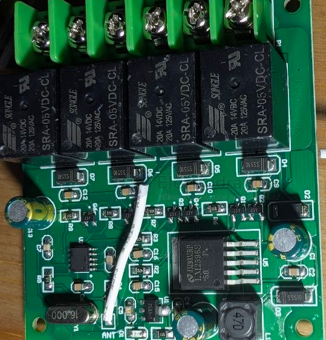

# motor-driver-rc-dat

- [[rc-dat]] - [[rc-hack-dat]]

- [[motor-driver-dat]]

- [[motor-brushed-dat]] - [[motor-driver-dc-dat]] 

- [[motor-brushless-dat]] - [[ESC-dat]]

- [[rc-dat]] - [[motor-driver-dat]] - [[motor-driver-rc-dat]] - [[capacitor-start-dat]]

- [[TA6586-dat]] - [[motor-driver-dat]] - [[ruizhi-dat]] - [[RZ7886-dat]]

- [[frequency-dat]] - [[frequency-rc-dat]] - [[rf-2.4ghz-dat]]

- [[capacitor-start-dat]] for normal small [[motor-brushed-dat]] == 104 0.1UF

- [[motor-dat]] - [[motor-driver-DC-dat]] - [[motor-driver-rc-dat]]

- [[DRV8871-dat]]

- [[VNH5019-dat]] - [[BTS7960-dat]] 

## common RC motor driver pairing 

对频方法：自动对频，先给遥控发射板通电，LED灯闪烁，再给接收板通电后发射板指示灯熄灭对频成功。

## high current drive 

- [[relay-dat]]

- SS510 

## ref 

