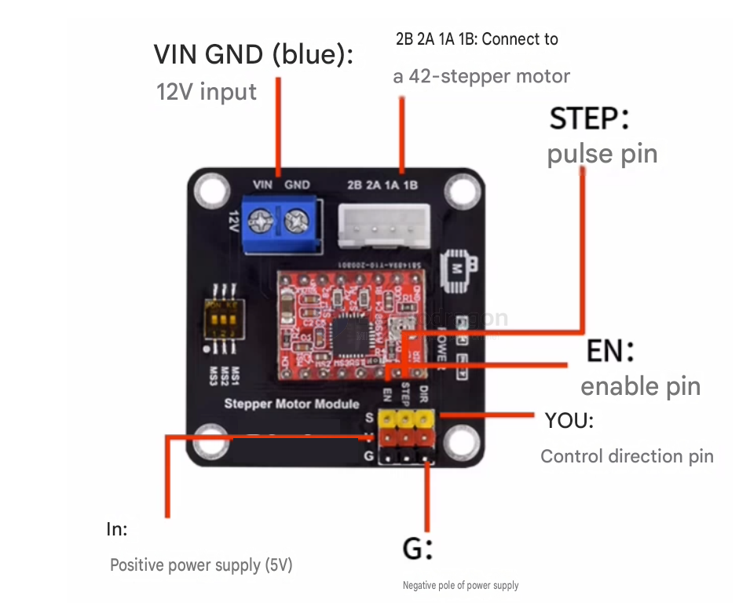

# stepper-driver-dat

- [[motor-stepper-dat]] - [[motor-driver-stepper-dat]]

- [[DRV8825-dat]] - [[SDR1040-dat]] - [[SDR1113-dat]]

- [[SDR1042-dat]] [[A4988-dat]] - [[DRV8825-dat]] - [[SDR1040-dat]] - [[motor-driver-stepper-dat]]

## stepper motor 

- [[AT2100-dat]] - [[zhongkewei-dat]]

- [[TMC2100-dat]] - [[analog-device-dat]] - [[AD-motor-driver-dat]] - [[TMC2208-dat]] - [[TMC21030-dat]] 

- [[TI-motor-dat]] - [[DRV8833-dat]] - [[DRV8825-dat]] - [[drv8837-dat]] - [[drv8313-dat]] - [[DRV8871-dat]] - [[DRV8876-dat]] - [[DRV84x2-dat]]

- [[motor-stepper-dat]]

- [[TB67H450-dat]] - [[TB6612-dat]] - [[toshiba-dat]]
 
- [[A4988-dat]]

- [[LV8729-dat]] 

- [[L293-dat]] - [[L298-dat]] 

- [[ULN2003-dat]]

- [[TB6600-dat]]

## use guide 

## ref 

- [[motor-driver-dat]]